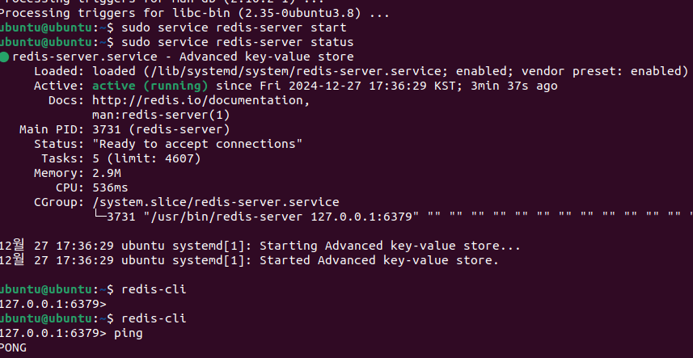
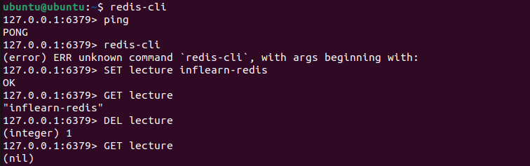

# Windows에 Redis 설치

1. WSL 활성화

    - Redis는 Windows에 지원안된다
    - WSL2를 활성화하면 Linux 바이너리를 기본적으로 실행할 수 있다(Windows 10버전 이상)
    - wsl 명령 설치 : PowerShell 관리자 권한으로 실행한 후 명령어 입력(wsl --install)

2. Redis 설치 (Ubuntu - Oracle Virtual Box)

    ``` bash
    # Redis GPG 키 추가
    curl -fsSL https://packages.redis.io/gpg | sudo gpg --dearmor -o /usr/share/keyrings/redis-archive-keyring.gpg

    # curl 설치 (필요하면 실행)
    snap install curl

    # Redis 패키지 소스 추가
    echo "deb [signed-by=/usr/share/keyrings/redis-archive-keyring.gpg] https://packages.redis.io/deb $(lsb_release -cs) main" | sudo tee /etc/apt/sources.list.d/redis.list

    # 패키지 목록 업데이트
    sudo apt-get update

    # Redis 설치
    sudo apt-get install redis

    # Redis 서버 실행
    sudo service redis-server start

    # Redis 서버 실행 확인 방법 => Active: active (running)
    sudo service redis-server status
    ```
        

## redis-cli에서 간단한 실행

1. Redis CLI : Redis 서버에 명령어 전달하기 위해서 사용하는 프로그램

2. Ping이라는 명령어를 전달했을때 Pong이 리턴되면 Redis가 정상적으로 명령을 전달하고 있다는 것을 확인할 수 있다

3. Redis에 데이터 저장, 조회, 삭제(대소문자 구분 안함)

    - 저장 : SET lecture inflearn-redis => OK 반환
    - 조회 : GET lecture => "inflearn-redis"
    - 삭제 : DEL lecture => 1
    - nil : Redis에서 데이터가 없다는 것을 의미

        