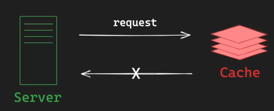
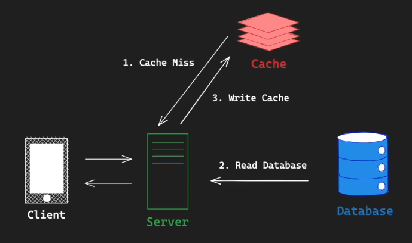

# Redis 소개

Remote Dictionary Server
Open Source In-Memory Data Store written in ANSI-C

- 다수의 서버를 사용하는 분산 환경의 서버가 공통으로 사용할 수 있는 해시 테이블을 의미미
- Remote Server? 각가의 서버 안에 로컬하게 존재하지 않고 다수의 서버에서 공통적으로 사용할 수 있도록 원격에 존재
- Dictionary? 해시맵과 같이 키 밸류 형태로 상수의 시간 복잡도로 이용 가능
- In-Memory Data Store?  Redis가 백업을 제외한 모든 데이터를 RAM에 저장 / 램은 디스크에 비해 매우 빠르기 때문에 Refis는 기본적인 관계형 db와 다른 구조의 특정을 가짐

## Redis 특징

1. In-Memory : 모든 데이터를 RAM에 저장(백업 / 스냅샷 제외)

2. Single Threaded : 단일 thread에서 모든 task 처리 

    - 프로그램의 복잡도를 증가시킬 수 있기 때문에 Redis는 과감하게 단일스레드를 사용하는 단순한 디자인 채택
    - 이러한 단순함이 장점이 되어 레디스는 성능이 뛰어나고 사이드 이펙트가 거의 없는 매우 안정적인 기술

3. Cluster Mode : 다중 노드에 데이터를 분산 저장하여 안정성 & 고가용성 제공

4. Persistence : RDB(Redis Database) + AOF(Append only file) 통해 영속성 옵션 제공(안전하다)

5. Pub/Sub : Pub/Sub 패턴을 지원하여 손쉬운 어플리케이션 개발(e.g 채팅, 알림 등)

- Pub/Sub 패턴 : 메시징 시스템에서 발행자(Publisher)와 구독자(Subscriber)를 분리하여 비동기적으로 데이터를 전달하는 디자인 패턴
- 시스템 간의 의존성을 줄이고 유연성과 확장성을 높이는데 사용합니다

## Redis 장점

1. 높은 성능 : 모든 데이터를 메모리에 저장하기 때문에 매우 빠른 읽기/쓰기 속도 보장

2. Data Type 지원 : Redis에서 지원하는 Data type을 잘 활용하여 다양한 기능 구현

    - Data type이 직관적인 인터페이스로 구현되어 있고 전반적인 성능이 뛰어남!! 

3. 클라이언트 라이브러리 : Python, Java, JavaScript등 다양한 언어로 작성된 클라이언트 라이브러리 지원(벡엔드와 쉽게 연동)

4. 다양한 사례 / 강한 커뮤니티 : Redis를 활용하여 비슷한 문제를 해결한 사례가 많고, 커뮤니티 도움 받기 쉬움

## Redis 사용

1. Caching : 임시 비밀번호(One-Time Password) / 로그인 세션(Session)

2. Rate Limiter : Fixed-Window / Sliding-Window Rate Limiter(비율 계산기)

    - Rate Limiter : 보통 서버에서 특정 API에 대한 요청 횟수를 제한하기 위해 사용하는 기술로 Redis를 활용하면 쉽게 구현 가능

3. Message Broker : 메시지 큐(Message Queue)

    - Redis의 List나 Stream 같은 데이터 타입을 활용하여 메시지 브로커를 구현하면 다양한 서비스 간의 커플링(의존성)을 줄일 수 있다

4. 실시간 분석 / 계산 : 순위표(Rank / Leaderboar), 반경 탐색(Geofencing), 방문자 수 계산(Visitors Count)

5. 실시간 채팅 : Pub/Sub 패턴

## Redis의 영속성(Persistence)

1. Refis는 주로 캐시로 사용되지만 데이터 영속성을 위한 옵션 제공(캐시라 하더라도 데이터가 손상되었을 때 서비스 지연을 막기 위해서)

2. SSD와 같은 영구적인 저장 장치에 데이터 저장

3. RDB(Redis Database) : Point-in-time Snapshot -> 재난 복구(Disaster Recovery) 또는 복제에 주로 사용

    - 장애가 발생했을 때 특정 시점에 스냅샷으로 빠르게 캐시를 되돌리거나 동일한 데이터를 가진 캐시를 복제할 때 주로 사용
    - 스냅샷의 특성상 새로운 스냅샷이 생성되기 이전에 일부 데이터의 유실이 있을 수 있다 

4. AOF(Append Only File)

    - Refis에 저장되는 모든 Write 작업을 모두 log로 저장
    - 데이터 유실의 위험이 적지만, 재난 복구시 Write 작업을 다시 적용하기 때문에 RDB보다 느림

5. RDB + AOF : 함께 사용하는 옵션제공

    - 둘다 사용하거나 둘다 사용하지 않거나 하나만 사용하는 등 사용자가 필요에 맞게 옵션을 조절하여 사용할 수 있도록 지원한다

## Caching

1. 데이터를 빠르게 읽고 처리하기 위해 임시로 저장하는 기술

2. 계산된 값을 임시로 저장해두고, 동일한 계산 / 요청 발생 시 다시 계산하지 않고 저장된 값 바로 사용

3. 캐싱은 이런 기술을 의미하고 캐시(Cache)는 임시 저장소를 의미

    - CPU 캐시 : CPU와 RAM의 속도 차이로 발생하는 지연을 줄이기 위해 L1, L2, L3 캐시 사용

    - 웹 브라우저 캐싱 : 웹 브라우저가 웹 페이지 데이터를 로컬 저장소에 저장하여 해당 페이지 재방문시 사용
    
    - DNS 캐싱 : 이전에 조회한 도메인 이름과 해당하는 IP 주소를 저장하여 재요청시 사용

    - 데이터베이스 캐싱 : 데이터베이스 조회나 계산 결과를 저장하여 재요청시 사용(MySQL과 같은 db는 버퍼풀이라는 곳에 자주 사용되는 데이터를 메모리에 따라 올려놓고 사용한다)

    - CDN : 이미지나 동영상 같은 큰 파일들은 cdn이라는 곳에 캐싱되는데 용량이 큰 원본 서버의 컨텐츠를 PoP 서버에 저장하여 사용자와 가까운 서버에서 요청 처리

    - 어플리케이션 캐싱 : 어플리케이션에서 데이터나 계산 셜과를 캐싱하여 반복적 작업 최적화

## Cache Hit / Miss

1. Cache Hit

    - Redis와 같은 캐시 서버에 특정 키를 가진 캐시를 요청했을 때 정상적으로 응답이 오는 경우 
    - 캐시 데이터가 존재하는 경우

        

2. Cache Miss

    - 키가 잘못되었거나 해당 데이터가 이미 만료되어 데이터를 응답하지 못하는 경우

        

## Cache-Aside pattern(캐시 전략 중 하나)

- 애플리케이션에서 클라이언트 요청을 처리할 때 먼저 캐시를 조회하여
- 캐시가 히트면 그대로 캐시를 사용하여 요청을 처리하되
- 캐시가 미스인 경우 원본 스토리지에서 데이터를 조회하여 데이터를 캐싱하는 패턴
- 가장 흔한 형태

    