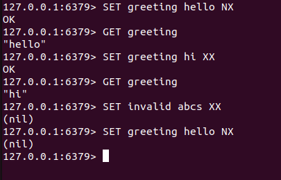
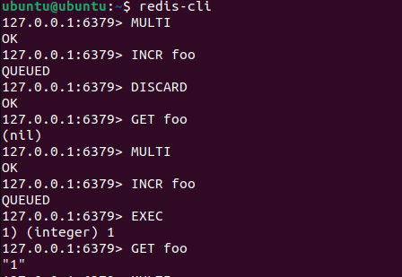

# 1. Redis 특수명령어

## 1. 데이터 만료

- Expiration : 데이터를 특정시간 이후에 만료 시키는 기능
- TTL(Time To Live) : 데이터가 유효한 시간(초 단위, e.g. TTL 60 : 해당 데이터가 저장된 이후 60초 동안만 유효하다는 의미)
- 특징

    1. 만료된 데이터는 데이터 조회 요청시에 조회되지 않음
    2. 데이터를 저장한 이후에 만료시키지 않게 되면 해당 데이터가 계속 저장 공간을 차지하고 있어서 만료시키는것이 중요함!
    3. 데이터가 만료되자마자 삭제하지 않고, 만료로 표시했다가 백그라운드 테스크에 의해서 주기적으로 삭제
    
- 명령어

    ``` bash
    SET greeting heello
    // EXPIRE는 데이터 만료 명령어
    EXPIRE greeting 10

    // TTL은 해당 데이터의 남은 만료 시간을 확인(리턴이 -1이면 설정되어 있지 않음을 의미)
    TTL greeting

    // SET EXPIRE 명령어는 데이터 저장과 동시에 만료를 적용 
    SETEX greeting 10 hello
    ```

    


## 2. SET NX/XX

- NX : 해당 Key가 존재하지 않는 경우에만 SET(새로운 데이터 저장)
- XX : 해당 Key가 이미 존재하는 경우에만 SET
- Null Reply : SET이 동작하지 않은 경우 (nil) 응답
- 명령어

    ``` bash
    SET greeting hello NX
    SET greeting hello XX
    SET invalid hi XX       // nil
    ```

    

## 3. Pub/Sub

- Pub/Sub 
    1. Publisher와 Subscriber가 서로 알지 못해도 통신이 가능하도록 decoupling 된 패턴
    2. 최대 장점은 두 시스템 간의 강한 커플링을 줄일 수 있다
    3. Publisher는 Subscriber에게 직접 메시지를 보내지 않고, Channel에 Publish
    4. Subscriber는 관심이 있는 Channel을 필요에 따라 Subscribe하며 메시지 수신
    5. (vs. Stream) 메시지가 보관되는 Stream과 달리 Pub/Sub은 fire and forget 메커니즘이 적용되어 있어서 Subscribe 하지 않을 때 발행된 메시지 수신 불가
    (e.g. 스톡 서비스는 주문 상태에 따라서만 영향을 받기 때문에 주문 채널만 구독하면 되고 알림을 전송하는 노티피케이션 서비스에서는 주문, 결제, 배송의 모든 이벤트를 추적하기 위해 여러 개의 채널을 모두 구독할 수 있다)

- 명령어

    ``` bash
    // 컨슈머는 원하는 채널을 구독
    SUBSCRIBE ch:order ch:payment
    // 퍼블리셔는 원하는 채널의 메시지를 퍼블리쉬
    PUBLISH ch:order new-order
    PUBLISH ch:payment new-payment
    // 구독하지 않은 곳에서 메시지 퍼블리쉬 : 메시지 전달x, 출력x
    PUBLISH ch:delivery new-delivery
    ```

    

## 4. Pipepline

- Pipelining : 다수의 commands를 한 번에 요청하여 네트워크 성능을 향상 시키는 기술
- Round-Trip Times(일반적인 request, response 모델에서 요청과 응답에 따라 네트워크를 통해 트래픽이 오고 가며)이 발생하는데 트립의 횟수를 줄여서 네트워크 시간을 최소화하는 기술
- 대부분의 클라이언트 라이브러리에서 지원

## 5. Transaction

- Transaction
    1. 다수의 명령을 하나의 트랜잭션으로 처리 -> 원자성(Atomicity) 보장
    2. 원자성이 유지되기 때문에 다수의 명령어가 처리되는 중간에 에러가 발생하면 모든 작업이 Rollback
    3. 트랜잭션이 처리되는 중간에 다른 클라이언트의 요청이 끼어들 수 없다

- Atomicity 
    1. All or Nothing / 모든 작업이 적용되거나 하나도 적용되지 않는 특성
    2. (vs. Pipeline) Pipeline은 네트워크 퍼포먼스 향상을 위해 여러 개의 명령어를 한 번에 요청(개별적으로 수행), Transaction은 작업의 원자성을 보장하기 위해 다수의 명령을 하나처럼 처리하는 기술
    3. Pipeline과 Transaction을 동시에 사용 가능

- 명령어

    ``` bash
    // 트랜잭션 시작 명령어
    MULTI
    INCR foo
    // ROLLBACK 명령어
    DISCARD
    // transaction을 실행할 때
    EXEC
    ```

    