# 데이터 타입(Data Type) 알아보기

## 1. Strings

- 문자열, 숫자, serialized object(JSON string, 직렬화된 형태의 오브젝트) 등 저장

- 명령어 

    ``` bash
    # Leture라는 키로 String 타입의 값을 저장
    SET lecture inflearn-redis

    # MSET은 멀티셋의 약자로 다수의 String 값을 한 번에 저장
    MSET price 100 language ko

    # MGET은 다수의 키의 값을 한 번에 반환하는 명령어
    MGET lecture price language

    # Redis는 별도의 인티저 타입 없이 스트링으로 숫자를 저장
    # INCR명령어는 increase의 약자로 숫자형 스트링 값을 1올릴 때 사용
    INCR price

    # INCREASEBY는 숫자형 스트링의 값에 특정 값을 더할 때 사용
    INCRBY price 10

    # Redis는 JSON 스트링을 직접 저장할 수 있따
    SET inflearn-redis '{"price": 100, "language": "ko"}'

    # Redis에서는 일반적으로 키를 만들 때 콜론을 이용하여 의미별로 구분해준다
    SET inflearn-redis:ko:price 200
    ```

    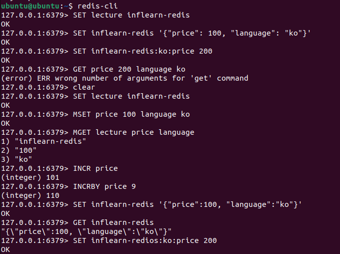

## 2. Lists

- String을 Linked List로 저장하는 데이터 타입 -> push/pop에 최적화 O(1)
- Redis의 리스트는 각 노드가 이전 노드와 다음 노드를 가리키는 포인트를 갖고 있는 더블리 링크드 리스트이다
- Redis 리스트를 활용하면 큐나 스택을 쉽게 구현할 수 있다
- 명령어

    ``` bash
    # FIFO(first in, first out, queue)
    LPUSH queue job1 job2 job3   # 여러 요소를 한번에 추가가
    RPOP queue                   # 가장 먼저 들어온게 나옴

    # LIFO(last in, first out, stack)
    LPUSH stack job1 hob2 job3
    LPOP stack                  # 가장 마지막으로 들어온게 먼저 나옴

    # LRANGE을 사용하면 리스트에서 다수의 아이템을 조회할 수 있는데 이때는 인덱스를 이용한다
    LPUSH queue job1 job2 job3
    LRANGE queue -2 -1

    # LTRIM은 나머지 부분만 남기기
    LTRIM queue 0 0
    ```

    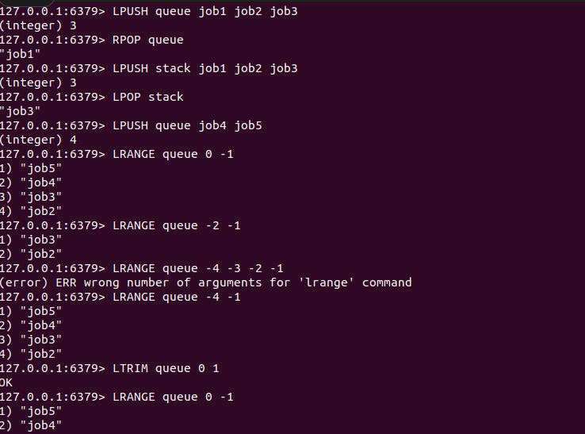


## 3. Sets

- 중복 없이 Unique string 값을 저장하는 정렬되지 않은 집합
- Set Operation 사용 가능(e.g. intersection, union, difference)
- 명령어

    ``` bash
    # SADD는 셋에 데이터 추가 / orange를 두번 추가해도 한번 반영
    SADD user:1:fruits apple banana orange orange

    # SMEMBERS는 셋의 모든 멤버를 출력 
    SMEMBERS user:1:fruit

    # SCARD는 셋의 카디널리티(고유한 아이텐의 개수)를 출력
    SCARD user:1:fruit

    # SISMEMBER는 특정 아이템이 셋에 포함되었는지를 확인(있으면 1, 없으면 0으로 출력값이 나온다다)
    SISMEMBER user:1:fruits banana

    # 집합의 연산을 알아보기위해 user2가 좋아하는 과일도 추가
    SADD user:2:fruits apple lemon

    # SINTER는 공통으로 좋아하는 데이터를 뽑아냄
    SINTER user:1:fruits user:2:fruits

    # SDIFF는 차집합에 해당하는 과일을 뽑아냄
    SDIFF user:1:fruits user:2:fruits

    # SUNION은 모든 집합에 대한 값을 중복없이 뽑아냄
    SUNION user:1:fruits user:2:fruits
    ```

    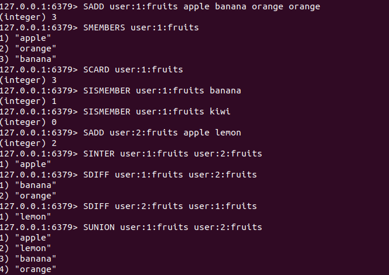


## 4. Hashes

- field-value 구조를 갖는 데이터 타입으로 프로그래밍 언어에서 Dictionary나 Map과 유사한 개념이다
- 다양한 속성을 갖는 객체의 데이터를 저장할 때 유용
- 명령어

    ``` bash
    # HSET은 해시를 생성한다(다수의 Field와 Value를 한 번에 저장할 수 있다)
    HSET lecture name inflearn-redis price 100 language ko

    # HGET은 하나의 필드를 조회하는 명령어
    HGET lecture name

    # HMGET은 다수의 필드를 조회하는 명령어(없는 필드를 조회한다면 nli이 나온다다)
    HMGET lecture price language invalid

    # HINCRBY는 숫자형으로 주장된 필드의 스트링 밸류를 특정 값만큼 더하는 명령어(숫자형이 아닌 필드의 값을 더하면 에러가 나온다)
    HINCRBY lecture price 10
    ```

    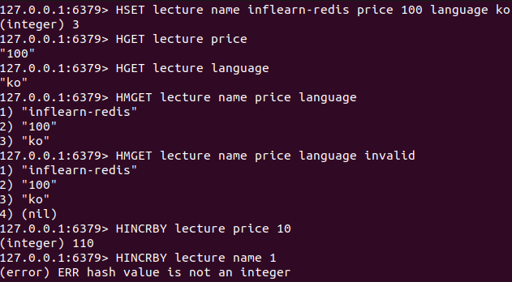


## 5. Sorted Sets(Zset)

- 중복없이 유니크한 String Value를 저장하는 Set과 유사하지만, score라는 추가적인 Field를 가짐으로써 해당 score를 통해 데이터를 미리 정렬하는 데이터 타입(Set의 기능 + 추가로 score 속성 저장)
- 내부적으로 Skip List + Hash Table로 이루어져 있고, 내부 구현에 따라 값을 추가하는 순간에 score 값에 따라 정렬 유지
- score가 동일하면 lexicographically(사전 편찬 순)으로 정렬
- 명령어

    ``` bash
    # ZADD는 Sorted sets를 생성하고 저장(A, B 값이 같으니까 사전 편찬 순위에 팀 A가 우선순위임)
    ZADD points 10 TeamA 10 TeamB 50 TeamC

    # ZRANGE는 인덱스를 통해 특정 범위를 조회
    ZRANGE points 0 -1

    # REV WITHSCORES(reverse with score)옵션은 역순으로 반환, score와 함께
    ZRANGE points 0 -1 REV WITHSCORES

    # ZRANK는 해당 아이템의 랭킹을 반환(0부터 시작한 인덱스 값과 동일)
    ```

    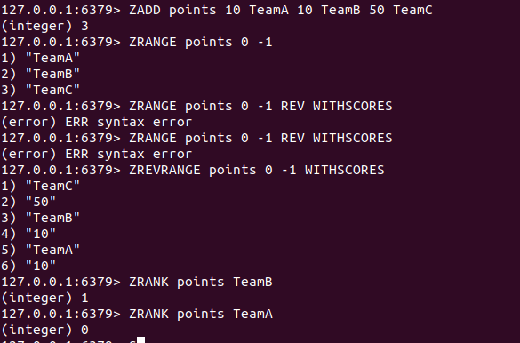


## 6. Streams

- append-only log에 consumer groups과 같은 기능을 더한 자료 구조
- 카프카와 같은 이벤트 스트리밍 플랫폼과 어느 정도 유사한 부분이 있다
- append-only-log란 데이터베이스나 분산 시스템에 주로 사용되는 데이터 저장 알고리즘으로 데이터가 수정되거나 삭제되지 않고 항상 추가만 되는 구조를 갖는다
- 추가기능

    1. unique id를 통해 하나의 entry를 읽을 때, O(1) 시간 복잡도(unique id는 스트림에 추가되는 시간과 순서를 기준으로 레디스에 의해 자동으로 할당)

    2. Consumer Group을 통해 분산 시스템에서 다수의 consumer가 event 처리(리스트를 통해 구현했던 메시지 브로커의 경우 다수의 컨슈머에서 메시지를 컨슈밍 할 때 동일한 메시지를 여러 번 처리하는 경우가 발생할 수 있는데, 레디스의 스트림 컨슈머 그룹을 이용하면 다수의 컨슈머가 메시지를 처리하면서도 동일한 메시지를 중복 처리하는 문제를 쉽게 해결할 수 있다)

- 명령어

    ``` bash
    # XADD는 스트림의 nt를 추가하게 되고 key 이후에 star(*) 옵션을 주면 Redis에 자동으로 유니크한 읽기가 할당(하나의 이벤트[1번 유저가 프로젝트 아이디1을 좋아요]를 이 스트림에 추가한다는 의미, unique id가 출력됨)
    XADD events * action like user_id 1 product_id 1
    XADD events * action like user_id 2 product_id 1

    # XRANGE는 리스트와 유사하게 다수의 메시지를 조회
    XRANGE evemts -+

    # XDEL은 스트림에서 제거
    ```

    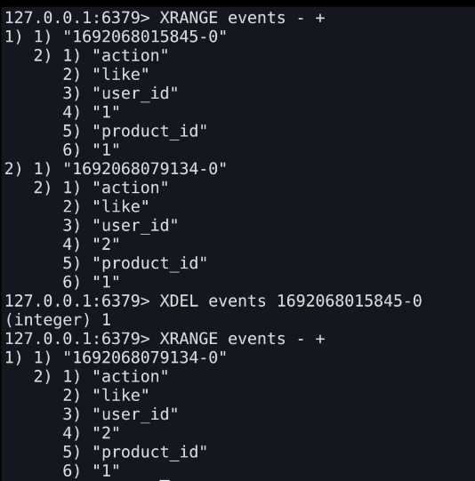

## 7. Geospatial

- 좌표를 저장하고, 검색하는 데이터 타입
- 거리 계산, 범위 탐색 등 지원
- 명령어

    ``` bash
    # GEOADD를 통해 좌표를 저장(경도, 위도 순으로 추가)
    GEOADD seoul:station
        126.923917 37.556944 hong-dae
        127.027583 37.497928 gang-nam
    
    # GEODIST를 통해 좌표 사이의 거리 구하기 가능(옵션을 통해 출력하는 단위 조정 가능)
    GEODIST seoul:station hong-dae gang-nam
    ```

    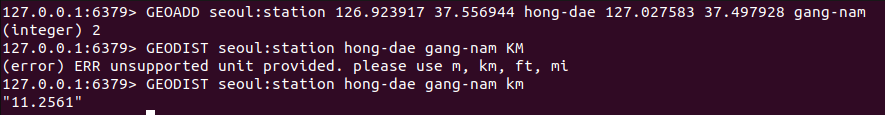


## 8. Bitmaps

- 실제 데이터 타입은 아니고, String에 binary operaion을 쉽게 사용할 수 있도록 만들어놓은 인터페이스
- 최대 42억개 binary 데이터 표현 = 2^32(4,294,967,296)
- 적은 메모리를 사용하여 바이너리 상태값을 저장하는 데 많이 활용
- 명령어

    ``` bash
    # SETBIT는 여부를 저장..
    SETBIT user:log-in:23-01-01 123 1   // 123유저가 1일에 로그인
    SETBIT user:log-in:23-01-01 456 1   // 456유저가 1일에 로그인
    SETBIT user:log-in 23-01-02 123 1   // 123 유저가 2일에 로그인

    # BITCOUT는 그것에 해당하는 수 출력
    BITCOUNT user:log-in:23-01-01

    # BITOP AND는 모두에 해당하는 수를 확인(AND, OR, XOR도 있음)
    BITOP AND result 
        user:log-in:23-01-01 user:log-in:23-01-02

    # GETBIT는 결과 확인(결과는 바로 출력되지 않고 result라는 키의 비트맵에 저장된다, 1이 나오면 해당되는것이고 0이면 아님)
    GETBIT result 123
    ```

    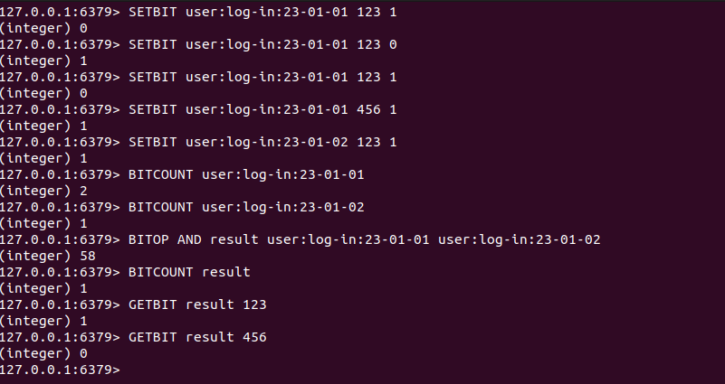


## 9. HyperLogLog

- 집합의 cardinality를 추정할 수 있는 확률형 자료구조(확률형 자료 구조 : 결과값이 실제와 일정 부분 오차가 발생할 수 있다는 의미)
- 카디널리티를 계산할 때 추정이라는 표현을 사용
- 정확성을 일부 포기하는 대신 저장공간을 효율적으로 사용(평균 에러 0.81%)
- 정확한 값을 알 필요가 없고 근사치만 알아도 되는 경우에 HyperLogLog를 사용할 수 있다
- 실제 값을 저장하지 않기 때문에 매우 적은 메모리만 필요하다
- 명령어

    ``` bash
    # PFAD를 사용해 HyperLogLog의 멤버를 추가할 수 있다
    PFADD fruits apple orange grape kiwi

    # PFCOUNT를 사용해 HyperLogLog의 카디널리티를 출력
    PFCOUNT fruits
    ```

    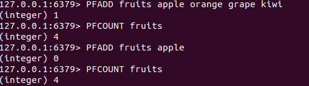

    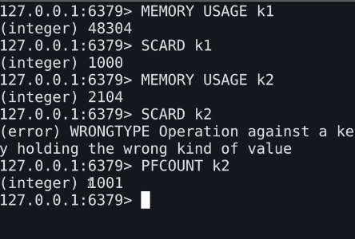


## 10. BloomFilter

- element가 집합 안에 포함되었는지 확인할 수 있는 확률형 자료 구조(=membership test)
- 정확성을 일부 포기하는 대신 저장공간을 효율적으로 사용
- element 집합에 실제로 포함되지 않은데 포함되었다고 잘못 예측하는 경우가 있다
- 실제 값을 저장하지 않기 때문에 Set에 비해 매우 적은 메모리 사용
- 명령어

    ``` bash
    # docker desktop download : https://docs.docker.com/desktop/install/windows-install/

    # 컨테이너 실행 : docker run -p 63790:6379 -d --rm redis/redis-stack-server

    # BF.MADD는 집합의 아이템을 추가
    BF.MADD fruits apple orange

    # BF.EXISTS는 해당 아이템이 집합에 이미 포함되어 있는지 확인
    BF.EXISTS fruits apple
    ```

    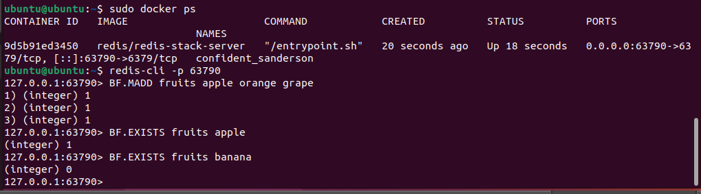