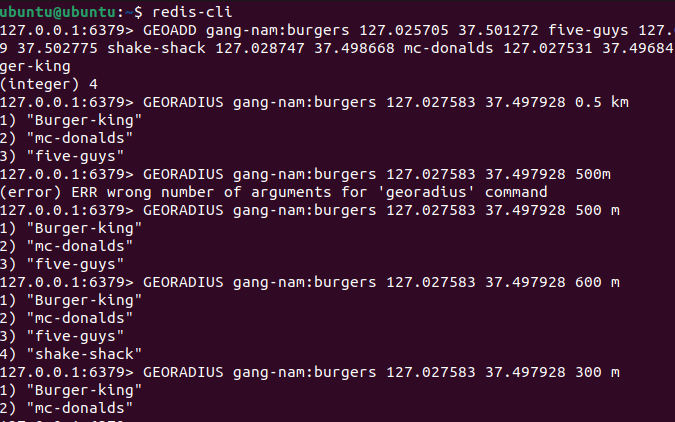

# 1. 데이터 타입 활용

## 1. String - One Time Password(임시 비밀번호)

- One-Time-Passwprd : 인증을 위해 사용되는 임시 비밀번호(e.g. 6자리 랜덤 숫자)
- OTP는 일정 시간 동안만 유효하고 회원 가입 과정에서만 잠깐 사용되는 데이터이기 때문에 Redis를 활용하면 매우 쉽게 구현할 수 있다
- 동작 방식

    1. 휴대폰 번호에 맞게 캐시 키를 생성
    2. set 명령어를 통해 임시 코드를 값으로 저장
    3. 해당 코드가 유효한 시간만큼 TTL을 줌

    

## 2. String - Distributed Lock(분산 락)

- Distributed Lock : 분산 환경의 다수의 프로세스에서 동일한 자원에 접근할 때, 동시성 문제를 해결하기 위해 사용되는 락
- (vs. Record Lock) : 안전하게 일관성을 유지할 수 있지만 레코드가 존재하지 않는 경우에 락을 사용할 수 없고 DB 성능 저하도 발생할 수 있기 때문에 필요에 따라 분산 락과 레코드 락을 사용하는 것이 필요하다 

- 동작방식

    1. 해당 공유 자원을 표현할 수 잇는 이름을 통해 락의 키를 결정
    2. nx 옵션을 통해 해당 키가 존재하지 않는 경우에만 락을 획득할 수 있도록 하고 이미 존재하여 락을 획득할 수 없는 경우에는 nil을 리턴하여 프로세스를 대기시킨다
    3. 해당 자원에 대한 작업이 끝나면 딜리트 명령어를 통해 락을 제거하여 다시 다른 프로세스에서 해당 자원을 사용할 수 있도록 한다

## 3. String - Fixed Window Rate Limiter(비율 계산기)

- Rate Limiter 
    1. 시스템 안정성/보안을 위해 요청의 수를 제한하는 기술
    2. IP-Based, User-Based, Application-Based, etc
    3. (e.g.) 특정 IP 별로 초당 요청할 수 있는 요청 수를 제한한다거나 특정 유저별로 횟수를 제한한다거나 특정 어플리케이션 별로 요청을 제한하는 식의 방법이 있다

- Fixed-window Rate Limiting : 고정된 시간(e.g. 1분)안에 요청 수를 제한하는 방법

- 동작 방식

    1. 요청을 기록 : 예를 들어, 0시 10분에 1.1.1.1이 20번의 요청을 보냈다면, 카운터가 20이 되고 추가 요청시 429 Too Many Requests 에러를 반환한다
    
    2. 새로운 시간대 시작 : 시간이 지나 1시 10분이 되면, 해당 키는 재사용되며 카운터가 초기화된다(새로운 시간 윈도우가 시작되면서 요청이 다시 허용)

    3. 최악의 경우 : 0시 9분 59초와 0시 10분 1초 사이에 40번의 요청이 허용될 수도 있는 문제점이 있음..

## 4. List - SNS Activity-Feed(소셜 네트워크 활동 피드)

- Activity Feed : 사용자 또는 시스템과 관련된 활동이나 업데이트를 시간순으로 정렬하여 보여주는 기능
- Fan-Out : 단일 데이터를 한 소스에서 여러 목적지로 동시에 전달하는 메시지 패턴

- 동작 방식

    1. 유저 1이 어떤 게시물에 좋아요를 누름
    2. 이 이벤트는 피드를 관리하는 서비스에 전달됨
    3. 피드 서비스는 유저의 팔로워들 또는 해당 내용에 관심을 가질 만한 유저들을 필터링하여 타겟이 될 만한 유저들에게 이 메시지를 전달(e.g. 유저 2, 3, 4중에 유저 2와 유저3만이 이 내용에 관심을 가질것 같다고 판단되면 해당 유저 피드에 이 내용을 추가)
    4. 유저 2가 자신의 피드를 조회 하면 고정된 수만큼(e.g. 0~9번 인덱스까지, 즉 10개의 아이템을), 가장 최신부터 읽어 유저2의 피드를 보여주게된다 

## 5. SET - Shopping Cart(장바구니)

- Shopping Cart : 사용자가 구매를 원하는 상품을 임시로 모아두는 가상의 공간
- 수시로 변경이 발생할 수 있고, 실제 구매로 이어지지 않을 수도 있다
- 레디스 셋을 이용하면 중복 상품에 대한 처리를 쉽게 할 수 있다
- 동작 방식(유저가 모바일과 데스크탑을 이용해서 수시로 장바구니 아이템을 추가하고 삭제한다고 가정했을때..)

    1. 유저가 장바구니에 상품을 추가하면 SADD
    2. 장바구니를 조회하고자 한다면 SMEMBERS 명령어로 셋의 아이템을 조회해서 보여주면 된다

## 6. Hash - Login Session(로그인 세션)

- Login Session : 사용자의 로그인 상태를 유지하기 위한 기술
    
    - 사용자가 로그인하면 서버에서는 해당 사용자를 고유하게 식별하기 위한 세션 아이디를 할당하고 이 세션 아이디를 사용해 이후 요청의 인증 과정 없이 사용자를 식별한다

- 동시 로그인 제한 : 로그인시 세션의 개수를 제한하여, 동시에 로그인 가능한 디바이스 개수 제한

- 동작 방식

    1. 로그인을 위해 사용자로부터 유저네임과 패스워드 같은 인증 정보를 넘겨받는다
    2. 인증이 완료되면 서버에서는 임의의 SessionID를 담아 반환한다
    3. 이후 클라이언트에서는 세션 아이디를 통해 결제가 필요한 유료 API에 접근 요청을 한다
    4. 서버에서는 레디스에 저장된 캐시를 확인한 뒤 해당 유저의 등급이 프리미엄이라는 것을 확인하고 유료 API 요청을 처리한다

## 7. Sorted Set - Sliding Window Rate Limiter(비율 계산기)

- Sliding Window Rate Limiter : 시간에 따라 Window를 이동시켜 동적으로 요청수를 조절하는 기술
- Fixed Window에 비해 동작이 복잡하지만 조금 더 세밀한 방식으로 요청 수를 제한한다
- (vs. Fixed Window) : Fixed Window는 window 시간마다 허용량이 초기화되지만, Sliding Window는 시간이 경과함에 따라 window가 같이 움직인다

## 8. Geospatial - Geofencing(반경 탐색)

- Geofencing : 위치를 활용하여 지도 상의 가상의 경계 또는 지리적 영역을 정의하는 기술
- 명령어

    ``` bash
    // GEOADD : 위치값 저장
    GEOADD gang-nam:burgers
        127.025705v37.501272 five-guys
        127.025699 37.502775 shake-shack
        127.028747 37.498668 mc-donalds
        127.027531 37.498847 burger-king

    // GEORADIUS : 해당 범위 안의 것만 검색
    GEORADIUS gang-nam:burgers
        127.027583 37.497928 0.5km
    ```
    
    

## 9. Bitmap - User Online Status(온라인 상태 표시)

- Online Status : 사용자의 현재 상태를 표시하는 기능
- 해당 사용자가 현재 온라인 상태인지 오프라인 상태인지를 표시
- 실시간성을 와벽히 보장하지는 않고 수시로 변경되는 값
- 동작 과정정
    1. FixedWindowTateLimiter를 구현했던 것처럼 현재 시간의 분을 기준으로 키를 생성해서 해당 유저가 서브와 통신을 주고받고 있는 경우 비트값을 1로 업데이트한다
    2. 이를 표시해주는 부분에서는 동일한 방법으로 키를 생성해 해당 유저의 온라인 상태를 조회할 수 있다
    3. 이후 해당 유저가 더 이상 서버의 통신을 하고 있지 않으면 비트값이 추가로 업데이트 되지 않고 유저의 상태는 오프라인으로 조회된다

## 10. HyperLogLog - Visitors Count(방문자 수 계산)

- Visitor Count Approximation : 방문자 수(또는 특정 횟수)를 대략적으로 추정하는 경우
- 정확한 횟루를 셀 필요 없이 대략적인 어림치만 알고자 하는 경우 HyperLogLog를 이용하면 해당 기능을 쉽게 구현할 수 있다
- 명령어

    ``` bash
    // PFADD는 HyperLogLog 자료 구조에 새로운 요소 추가(user 번호와 접속 시간간)
    PFADD today:users
        user:1:1693494070
        user:1:1693494071
        user:2:1693494071

    // PFCOUNT는 HyperLogLog 키에 저장된 고유 값의 추정치를 반환
    PFCOUNT today:users
    ```

## 11. BloomFilter - Unique Events(중복 이벤트 제거)

- Unique Events : 동일 요청이 중복으로 처리되지 않기 위해 빠르게 해당 item이 중복인지 확인하는 방법
- 동작 과정
    1. 이벤트의 데이터를 기준으로 해싱하거나 아니면 이벤트의 발생시간에 따라 고유한 아이디를 발급한다
    2. 이렇게 생성한 고유 아이디는 중복 데이터의 경우 동일하게 생성한다
    3. 이벤트를 처리하기 전에 고유 아이디를 기준으로 BloomFilter를 먼저 조회를 요청한다
    4. BloomFilter에 존재하지 않는다면 해당 데이터는 처리된 적이 없기 때문에 데이터를 저장한 이후에 BloomFilter에 고유 아이디를 추가한다
    5. 이미 존재한다고 나온다면 false positive 일 수도 있기 때문에 원본 데이터 소스를 한 번 더 조회하고 데이터를 처리한다