# 1. 컬렉션 자료 구조

## 1. 컬렉션 프레임워크

- 자바는 널리 알려져 있는 자료구조를 바탕으로 객체들을 효율적으로 추가, 삭제, 검색할 수 있도록 관련된 인터페이스와 클래스들을 java.util 패키지에 포함시켜 놓았다
- 이들을 총칭해서 컬렉션 프레임워크라고 부른다
- 주요 인터페이스로는 List, Set, Map이 있다

    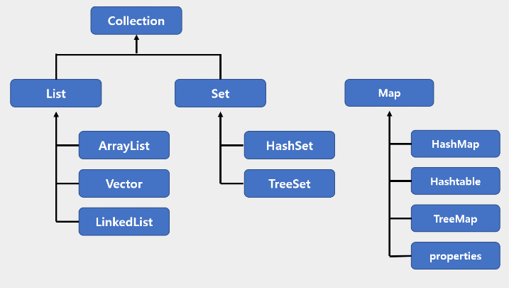

## 2. List

- List 컬렉션은 객체를 인덱스로 관리하기 때문에 객체를 저장하면 인덱스가 부여되고 인덱스로 객체를 검색, 삭제 할 수 있는 기능을 제공한다
- ArrayList, Vector, LinkedList 등이 있다
- 메소드

    | 기능 | 메소드 | 설명 |
    | ---- | ----- | ---- |
    | 객체 추가 | boolean add(E e) | 주어진 객체를 맨 끝에 추가 |
    | | void add(int index, E element) | 주어진 인덱스에 객체를 추가 |
    | | set(int index, E element) | 주어진 인덱스의 객체를 새로운 객체로 바꿈 |
    | 객체 검색 | boolean contains(Object o) | 주어진 객체가 저장되어 있는지 여부 |
    | | E get(int index) | 주어진 인덱스에 저장된 객체를 리턴 |
    | | isEmpty() | 컬렉션이 비어 있는지 조사 |
    | | int size() | 저장되어 있는 전체 객체 수를 리턴 |
    | 객체 삭제 | void clear() | 저장된 모든 객체를 삭제 |
    | | E remove(int index) | 주어진 인덱스에 저장된 객체를 삭제 |
    | | boolean remove(Object o) | 주어진 객체를 삭제 |

1. ArrayList

- List 컬렉션에서 가장 많이 사용하는 컬렉션
- 일반 배열과의 차이점은 ArrayList는 제한 없이 객체를 추가할 수 있다
- ArrayList 컬렉션에 객체를 추가하면 해당 인덱스부터 마지막 인덱스까지 모두 1씩 밀려나고 객체를 제거하면 바로 뒤 인덱스부터 마지막 인덱스까지 모두 1씩 당겨지므로..
- 빈번한 객체 삭제와 삽입이 일어나는 곳에서는 ArrayList를 사용하는 것은 바람직하지 않다(LinkedList 사용 추천)

    ``` java
    import java.util.ArrayList;
    import java.util.List;

    public class ArrayListExample {
        public static void main(String[] args) {
            // ArrayList 컬렉션 생성
            List<Board> list = new ArrayList<>();

            // 객체 추가
            list.add(new Board("제목1", "내용1", "글쓴이1"));
            list.add(new Board("제목2", "내용2", "글쓴이2"));
            list.add(new Board("제목3", "내용3", "글쓴이3"));
            list.add(new Board("제목4", "내용4", "글쓴이4"));
            list.add(new Board("제목5", "내용5", "글쓴이5"));

            // 저장된 총 객체 수 얻기
            int size = list.size();
            System.out.println("총 객체 수: " + size);
            System.out.println();

            // 특정 인덱스의 객체 가져오기
            Board board = list.get(2);
            System.out.println(board.getSubject() + "\t" + board.getContent() + "\t" + board.getWriter());
            System.out.println();

            // 모든 객체를 하나씩 가져오기
            for(int i = 0; i < list.size(); i++) {
                Board b = list.get(i);
                System.out.println(b.getSubject() + "\t" + b.getContent() + "\t" + b.getWriter());
            }
            System.out.println();

            // 객체 삭제
            list.remove(2);
            list.remove(2); // 2번 인덱스를 삭제하면 3번 인덱스가 2번 인덱스로 변경되므로 다시 2번 인덱스를 제거할 수 있음

            // 향상된 for문으로 모든 객체를 하나씩 가져오기
            for (Board b : list) {
                System.out.println(b.getSubject() + "\t" + b.getContent() + "\t" + b.getWriter());            
            }
        } 
    }
    ```

    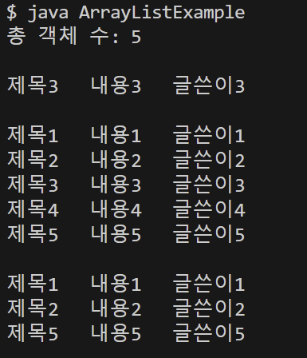

2. Vector

- 내부적으로 동기화 메커니즘을 제공하여 한 번에 한 스레드만 데이터에 접근할 수 있도록 한다(= 한 스레드가 작업을 완료할 때까지 다른 스레드는 기다리게 된다) -> 데이터 무결성 보장
- 여러 스레드가 대기해야 하므로, 속도가 느려질 수 있어 동기화가 필요 없는 단일 스레드 환경에서는 ArrayList를 사용하는 것이 더 효율적이다

    ``` java
    import java.util.Vector;

    public class VectorExample {
        public static void main(String[] args) {
            Vector<Integer> vector = new Vector<>();

            // thread 1 : 벡터에 요소 추가
            new Thread(() -> {
                for(int i = 0; i < 1000; i++) {
                    vector.add(i);
                    System.out.println(i + " ");
                }
            }).start();

            // thread 2 : 벡터의 요소 개수 출력
            new Thread(() -> {
                for(int i = 0; i < 1000; i++) {
                    System.out.println("^^" + vector.size());
                }
            }).start();
        }
    }

    // Vector는 내부적으로 동기화되어 있어, 데이터에 접근하는 스레드가 충돌하지 않도록 안전하게 처리됩니다
    // 한 스레드가 add()를 수행하는 동안 다른 스레드는 size()를 호출하지 못하고 대기합니다.
    ```

3. LinkedList

- LinkedList는 ArrayList와 사용 방법은 동일하지만 내부 구조는 완전히 다르다(ArrayList는 내부 배열에 객체를 저장하지만, LinkedList는 인접 객체를 체인처럼 연결해서 관리한다)

- LinkedList는 특정 위치에서 객체를 삽입하거나 삭제하면 바로 앞뒤 <strong>링크만 변경하면 되므로</strong> 빈번한 삭제와 삽입이 일어나는 곳에서는 ArrayList보다 좋은 성능을 발휘한다

- LinkedList에서 객체가 추가될 때의 과정 =>중간에 객체 추가 : 예를 들어, Node2뒤에 새로운 객체(NewNode)를 추가한다고 가정하면

    1. 새로운 노드 생성 (NewNode)
    2. Node2의 링크를 NewNode로 업데이트
    3. NewNode의 링크를 Node3로 설정
    4. 변경된 구조 : [Node1] -> [Node2] -> [NewNode] -> [Node3]

        - 기존 노드의 데이터는 이동하지 않고 링크만 업데이트하기 때문에 추가 연산의 비용이 일정하다다   
    
    ``` java
    import java.util.*;

    public class LinkedListExample {
        public static void main(String[] args) {
            // ArrayList 컬렉션 객체 생성
            List<String> list1 = new ArrayList<String>();

            // LinkedList 컬렉션 객체 생성
            List<String> list2 = new LinkedList<String>();

            // 시작과 끝 시간을 저장할 변수 선언
            long startTime;
            long endTime;

            // ArrayList에 데이터를 저장하는데 걸리는 시간 측정
            startTime = System.nanoTime(); 
            for (int i = 0; i < 10000; i++) {
                list1.add(0, String.valueOf(i));
            }
            endTime = System.nanoTime();
            System.out.println("ArrayList 걸린 시간: " + (endTime - startTime) + " ns");

            // LinkedList에 데이터를 저장하는데 걸리는 시간 측정
            startTime = System.nanoTime();
            for (int i = 0; i < 10000; i++) {
                list2.add(0, String.valueOf(i));
            }
            endTime = System.nanoTime();
            System.out.println("LinkedList 걸린 시간: " + (endTime - startTime) + " ns");
        }
    }
    ```

    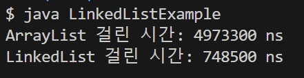


## 3. Set 컬렉션 

- List 컬렉션은 저장 순서를 유지하지만, Set 컬렉션은 저장 순서가 유지되지 않는다
- 객체를 중복해서 저장할 수 없고, 하나의 null만 저장할 수 있다
- HashSet, LinkedHashSet, TreeSet 등이 있다
- 메소드

    | 기능 | 메소드 | 설명 |
    | ---- | ----- | ---- |
    | 객체 추가 | boolean add(E e) | 주어진 객체를 성공적으로 저장하면 true를 리턴하고 중복 객체면 false를 리턴 |
    | 객체 탐색 | boolean contains(Object o) | 주어진 객체가 저장되어 있는지 여부 |
    | | isEmpty() | 컬렉션이 비어 있는지 조사 |
    | | Iterator<E> iterator() | 저장된 객체를 한 번씩 가져오는 반복자 리턴 |
    | | int size() | 저장되어 잇는 전체 객체 수 리턴 |
    | 객체 삭제 | void clear() | 저장된 모든 객체를 삭제 |
    | | boolean remove(Object o) | 주어진 객체를 삭제 |

1. HashSet

- Set 컬렉션 중에서 가장 많이 사용되는 것
- HashSet은 다른 객체라도 hashCode() 메소드의 리턴값이 같고, equals() 메소드가 true를 리턴하면 동일한 객체라고 판단하고 중복 저장하지 않는다(e.g. 같은 문자열일 경우, hashCode와 equals를 재정의할 경우)

    ``` java
    // 같은 문자열일 경우
    import java.util.*;

    public class HashSetExample {
        public static void main(String[] args) {
            // HashSet 컬렉션 객체 생성
            Set<String> set = new HashSet<String>();

            // 객체 저장
            set.add("Java");
            set.add("JDBC");
            set.add("Servlet/JSP");
            set.add("Java");    // 중복 객체이므로 저장하지 않음
            set.add("Spring");

            // 저장된 객체 수 출력
            int size = set.size();
            System.out.println("총 객체 수: " + size);  // 4
        }
    }

    // hashCode()를 재정의하고, equals() 메소드가 true를 리턴하도록 재정의한 경우

    // 1. Member.java
    public class Member {
        public String name;
        public int age;

        public Member(String name, int age) {
            this.name = name;
            this.age = age;
        }

        // hasCode 재정의
        @Override
        public int hashCode() {
            return name.hashCode() + age;
            // name과 age 값이 같으면 동일한 hashCode가 리턴됨
        }

        // equals 재정의
        @Override
        public boolean equals(Object obj) {
            if(obj instanceof Member target) {
                return target.name.equals(name) && (target.age==age);
            } else {
                return false;
            }
        }
    }

    // 2. HashSetExample.java
    import java.util.*;

    public class HashSetExample {
        public static void main(String[] args) {
            // HashSet 컬렉션 생성
            Set<Member> set = new HashSet<Member>();

            // Member 객체 저장
            set.add(new Member("홍길동", 30));
            set.add(new Member("홍길동", 30));

            // 저장된 객체 수 출력
            System.out.println("총 객체 수 : " + set.size());   // 1
        }
    }
    ```

2. Set의 객체 검색

    1) for 문 사용하기
    2)  iterator() 메소드로 반복자를 얻어 객체를 하나씩 가져오기

    - 메소드

        | 리턴 타입 | 메소드명 | 설명 |
        | -------- | -------- | ---- |
        | boolean | hasNext() | 가져올 객체가 있으면 true를 리턴하고 없으면 false를 리턴한다 |
        | E | next() | 컬렉션에서 하나의 객체를 가져온다 |
        | void | remove() | next()로 가져온 객체를 Set 컬렉션에서 제거한다 |
    
    - hasNext() 메소드로 가져올 객체가 있는지 먼저 확인하고, true를 리턴할 때만 next() 메소드로 객체를 가져온다

        ``` java
        public class HashSetExample {
            public static void main(Stirng[] args) {
                // HashSet 컬렉션 생성
                Set<String> set = new HashSet<String>();

                // 객체 추가
                set.add("Java");
                set.add("JDBC");
                set.add("JSP");
                set.add("Spring");

                // 객체를 하나씩 가져와서 처리
                Iterator<String> iterator = set.iterator();
                while(iterator.hasNext()) {
                    // 객체를 하나 가져오기
                    String element = iterator.next();
                    System.out.println(element);
                    if(element.equals("JSP")) {
                        // 가져온 객체를 컬렉션에서 제거
                        iterator.remove();
                    }
                }
                System.out.println();

                // 객체 제거
                set.remove("JDBC");

                // 객체를 하나씩 가져와서 처리
                for(String element : set) {
                    System.out.println(element);
                }
            }
        }
        ```

## 4. Map 컬렉션

- 키와 값으로 구성된 엔트리 객체를 저장한다(키와 값은 모두 객체)
- 키는 중복 저장할 수 없지만 값은 중복 저장할 수 있다
- 기존에 저장된 키와 동일한 키로 값을 저장하면 기존의 값은 없어지고 새로운 값으로 대치된다
- HashMap, Hashtable, LinkedHashMap, Properties, TreeMap등이 있다
- 메소드(key를 매개값으로 갖는 메소드가 많다)

    | 기능 | 메소드 | 설명 |
    | ---- | ----- | ---- |
    | 객체 추가 | V put(K key, V value) | 주어진 키와 값을 추가, 저장이 되면 값을 리턴 |
    | 객체 검색 | boolean containsKey(Object key) | 주어진 키가 있는지 여부 |
    | | boolean containsValue(Object value) | 주어진 값이 있는지 여부 |
    | | Set<Map.Entry<K, V>> entrySet() | 키와 값의 쌍으로 구성된 모든 Map.Entry 객체를 Set에 담아서 리턴 |
    | | V get(Object key) | 주어진 키의 값을 리턴 |
    | | boolean isEmpty() | 컬렉션이 비어있는지 여부 |
    | | Set<K> keySet() | 모든 키를 Set 객체에 담아서 리턴 |
    | | int size() | 저장된 키의 총 수를 리턴 |
    | | Collection<V> values() | 저장된 모든 값 Collection에 담아서 리턴 |
    | 객체 삭제 | void clear | 모든 Map.Entry(키와 값)를 삭제 |
    | | V remove(Object key) | 주어진 키와 일치하는 Map.Entry삭제, 삭제가 되면 값을 리턴

1. HashMap

    - HashMap은 키로 사용할 객체가 hashCode() 메소드의 리턴값이 같고 equals() 메소드가 true를 리턴할 경우, 동일 키로 보고 중복 저장을 허용하지 않는다
    - K와 V는 키와 값의 타입을 지정할 수 있는 타입 파라미터이다

        ``` java
        import java.util.*;

        public class HashMapExample {
            public static void main(String[] args) {
                // Map 컬렉션 생성
                Map<String, Integer> map = new HashMap<>();

                // 객체 저장
                map.put("신용권", 85);
                map.put("홍길동", 90);
                map.put("동장군", 80);
                map.put("홍길동", 95); // 키가 중복될 경우 나중에 저장한 값으로 대체
                System.out.println("총 Entry 수: " + map.size());
                System.out.println();

                // 키로 값 얻기
                String key = "홍길동";
                int value = map.get(key);
                System.out.println(key + ": " + value);
                System.out.println();

                // 키 Set 컬렉션을 얻고, 반복해서 키와 값을 얻기
                Set<String> keySet = map.keySet();
                Iterator<String> keyIterator = keySet.iterator();
                while(keyIterator.hasNext()) {
                    String k = keyIterator.next();
                    Integer v = map.get(k);
                    System.out.println(k + ": " + v);
                }
                System.out.println();

                // 엔트리 Set 컬렉션을 얻고, 반복해서 키와 값을 얻기
                Set<Map.Entry<String, Integer>> entrySet = map.entrySet();
                Iterator<Map.Entry<String, Integer>> entryIterator = entrySet.iterator();   // 엔트리를 반복하기 위해 반복자를 얻음
                while(entryIterator.hasNext()) {
                    Map.Entry<String, Integer> entry = entryIterator.next();
                    String k = entry.getKey();
                    Integer v = entry.getValue();
                    System.out.println(k + ": " + v);
                }
                System.out.println();

                // 키로 엔트리 삭제 
                map.remove("홍길동");
                System.out.println("총 Entry 수: " + map.size());
                System.out.println();
            }
        }
        ```

        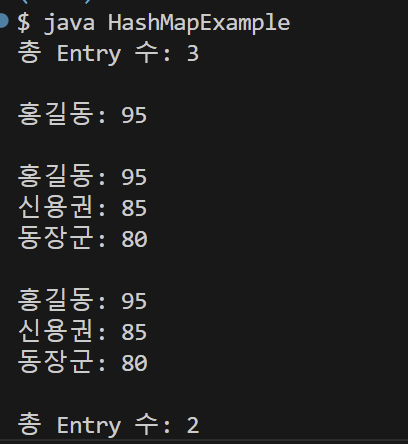

2. Hashtable

    - HashMap과 동일한 내부구조를 가지고 있지만 동기화된(synchronized) 메소드로 구성되어 있기 때문에 멀티 스레드가 동시에 Hashtable의 메소드들을  실행할 수 없다(Vector와 비슷)

        ``` java
        import java.util.Hashtable;

        public class HashtableExample {
            public static void main(String[] args) {
                // Hashtable 생성
                Hashtable<Integer, String> hashtable = new Hashtable<>();

                // 스레드 1: 데이터를 추가
                Thread thread1 = new Thread(() -> {
                    for (int i = 0; i < 5; i++) {
                        hashtable.put(i, "Value " + i);
                        System.out.println("Thread 1: 추가된 키 = " + i);
                        try {
                            Thread.sleep(100); // 다른 스레드와 경쟁 상황 유발
                        } catch (InterruptedException e) {
                            e.printStackTrace();
                        }
                    }
                });

                // 스레드 2: 데이터를 읽음
                Thread thread2 = new Thread(() -> {
                    for (int i = 0; i < 5; i++) {
                        if (hashtable.containsKey(i)) {
                            System.out.println("Thread 2: 읽은 값 = " + hashtable.get(i));
                        } else {
                            System.out.println("Thread 2: 키 " + i + " 없음");
                        }
                        try {
                            Thread.sleep(150); // 다른 스레드와 경쟁 상황 유발
                        } catch (InterruptedException e) {
                            e.printStackTrace();
                        }
                    }
                });

                // 두 스레드 실행
                thread1.start();
                thread2.start();

                // 스레드가 모두 종료될 때까지 대기
                try {
                    thread1.join();
                    thread2.join();
                } catch (InterruptedException e) {
                    e.printStackTrace();
                }

                // 최종 결과 출력
                System.out.println("최종 Hashtable 내용: " + hashtable);
            }
        }
        ```

        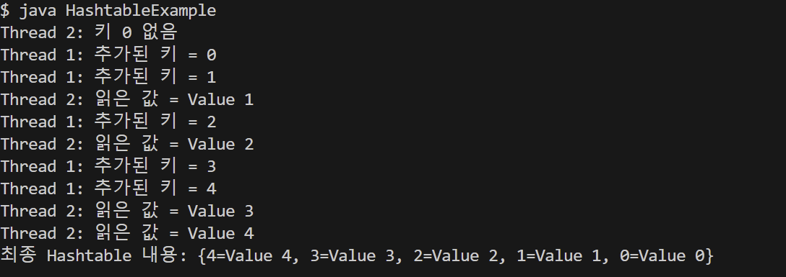

3. Properties

    - Properties는 키와 값을 String 타입으로 제한한 컬렉션
    - Hashtable의 자식 클래스이기 때문에 Hashtable의 특징을 그대로 가지고 있다
    - 주로 확장자가 .properties인 프로퍼티 파일을 읽을 때 사용한다다
    - 프로퍼티 파일은 키와 같이 = 기호로 연결되어 있는 텍스트 파일로 일반 텍스트 파일과 다르게 ISO 8859-1 문자셋으로 저장되며, 한글일 경우 \u+유니코드로 표현되어 저장된다

        ``` properties
        driver=oracle.jdbc.OracleDriver
        url=jdbc:oracle:thin:@localhost:1521:orcl
        username=scott
        password=tiger
        admin=\uD64D\uAE38\uB3D9
        ```
    
    - Properties을 사용하면 위와 같은 프로퍼티 파일의 내용을 코드에서 쉽게 읽을 수 있다

        ``` java
        // 1. Properties 객체를 생성
        Properties properties = new Properties();
        // 2. load() 메소드로 프로퍼티 파일의 내용을 메모리로 로드
        properties.load(Xxx.class.getResourceAsStream("database.properties"));
        ```
    
    - 프로퍼티 파일은 클래스 파일(*.class) 들과 함께 저장된다(클래스 파일을 기준으로 상대 경로를 이용해서 읽는 것이 편리)
    - Class 객체의 getResourceAsStream() 메소드는 주어진 상대 경로의 리소스 파일을 읽는 InputStream을 리턴한다

        ``` java
        import java.util.Properties;

        public class PropertiesExample {
            public static void main(String[] args) throws Exception {
                // Properties 컬렉션 생성
                Properties properties = new Properties();

                // PropertiesExample.class와 동일한 ClassPath에 있는 database.properties 파일 로드
                properties.load(PropertiesExample.class.getResourceAsStream("database.properties"));

                // 주어진 키에 대한 값 읽기
                String driver = properties.getProperty("driver");
                String url = properties.getProperty("url");
                String username = properties.getProperty("username");
                String password = properties.getProperty("password");
                String admin = properties.getProperty("admin");

                // 값 출력
                System.out.println("driver = " + driver);
                System.out.println("url = " + url);
                System.out.println("username = " + username);
                System.out.println("password = " + password);
                System.out.println("admin = " + admin);
            }
        }
        ```

        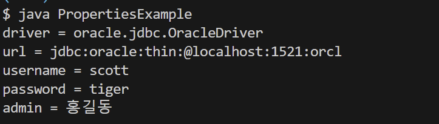


## 5. 검색 기능을 강화시킨 컬렉션

1. TreeSet

    - 이진 트리(binary tree)를 기반으로 한 Set 컬렉션
    - 이진 트리는 여러 개의 노드(node)가 트리 형태로 연결된 구조로, 루트 노드라고 불리는 하나의 노드에서 시작해 각 노드에 최대 2개의 노드를 연결할 수 있는 구조를 가지고 있다
    - TreeSet에 객체를 저장하면 부모노드의 객체와 비교해서 낮은 것은 왼쪽 자식 노드에, 높은것은 오른쪽 자식 노드에 자동 정렬된다
    - 검색 관련 메소드는 TreeSet에만 정의되어 있다(Set에는 없음)

        | 리턴 타입 | 메소드 | 설명 |
        | -------- | ------ | ---- |
        | E | first() | 제일 낮은 객체를 리턴 |
        | E | last() | 제일 높은 객체를 리턴 |
        | E | lower(E e) | 주어진 객체보다 바로 아래 객체를 리턴 |
        | E | higher(E e) | 주어진 객체보다 바로 위 객체를 리턴 |
        | E | floor(E e) | 주어진 객체와 동등한 객체가 있으면 리턴, 만약 없다면 주어진 객체의 바로 아래의 객체를 리턴 |
        | E | ceiling(E e) | 주어진 객체와 동등한 객체가 있으면 리턴, 만약 없다면 주어진 객체의 바로 위의 객체를 리턴 |
        | E | pollFirst() | 제일 낮은 객체를 꺼내오고 컬렉션에서 제거함 |
        | E | pollLast() | 제일 높은 객체를 꺼내오고 컬렉션에서 제거함 |
        | Iterator<E> | descendingIterator() | 내림차순으로 정렬된 Iterator를 리턴 |
        | NavigableSet<E> | decendingSet() | 내림차순으로 정렬된 NavigableSet을 리턴 |
        | NavigableSet<E> | headSet(EtoElement, boolean inclusive) | 주어진 객체보다 낮은 객체들을 NavigableSet으로 리턴, 주어진 객체 포함 여부는 두 번째 매개값에 따라 달라짐 |
        | NavigableSet<E> | tailSet(EfromElement, boolean inclusive) | 주어진 객체보다 높은 객체들을 NavigableSet으로 리턴, 주어진 객체 포함 여부는 두 번째 매개값에 따라 달라짐 |
        | NavigableSet<E> | subSet(EfromElement, boolean fromInclusive, E toElement, boolean toI clusive) | 시작과 끝으로 주어진 객체 사이의 객체들을 NavigableSet으로 리턴, 시작과 끝 객체의 포함 여부는 두 번째, 네 번째 매개값에 따라 달라짐 |

        ``` java
        import java.util.*;

        public class TreeSetExample {
            public static void main(String[] args) {
                // TreeSet 컬렉션 생성
                TreeSet<Integer> scores = new TreeSet<>();

                // Integer 객체 저장
                scores.add(87);
                scores.add(98);
                scores.add(75);
                scores.add(95);
                scores.add(80);

                // 정렬된 Integer 객체를 하나씩 가져오기
                for(Integer s : scores) {
                    System.out.println(s);
                }
                System.out.println();

                // 특정 Integer 객체를 가져오기
                System.out.println("가장 낮은 점수: " + scores.first());
                System.out.println("가장 높은 점수: " + scores.last());
                System.out.println("95보다 낮은 점수: " + scores.lower(95));
                System.out.println("95보다 높은 점수: " + scores.higher(95));
                System.out.println("95 이거나 바로 아래 점수: " + scores.floor(95));
                System.out.println("85 이거나 바로 위 점수: " + scores.ceiling(85));

                // 내림차순으로 정렬하기
                NavigableSet<Integer> descendingSet = scores.descendingSet();
                for(Integer s : descendingSet) {
                    System.out.println(s);
                }
                System.out.println();

                // 범위 검색(80 <= scores )
                NavigableSet<Integer> rangeSet = scores.tailSet(80, true);
                for(Integer s : rangeSet) {
                    System.out.print(s + " ");
                }
                System.out.println();

                // 범위 검색(80 <= scores < 95)
                rangeSet = scores.subSet(80, false, 95, true);
                for(Integer s : rangeSet) {
                    System.out.print(s + " ");
                }
            }
        }
        ```

        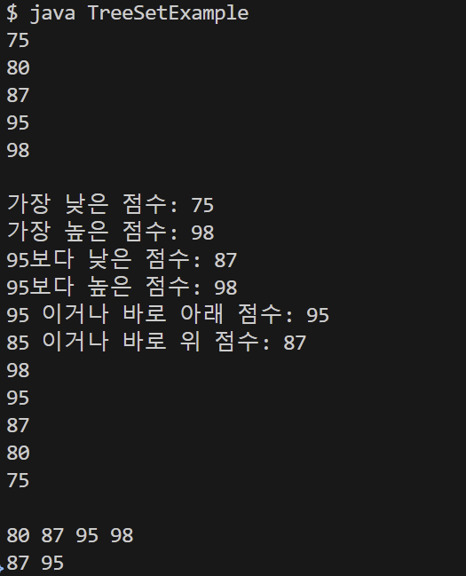

2. TreeMap

    - 이진 트리를 기반으로 한 Map 컬렉션으로 TreeSet과의 차이점은 키ㅇ와 값이 저장된 Entry를 저장한다
    - TreeMap에 엔트리를 저장하면 키를 기준으로 자동 정렬되는데, 부모 키 값과 비교해서 낮은 것은 왼쪽, 높은 것은 오른쪽 자식 노드에 Entry 객체를 저장한다
    -  TreeMap 타입에는 검색 관련 메소드들이 정의되어 있다

        | 리턴 타입 | 메소드 | 설명 |
        | --------- | ----- | ---- |
        | Map.Entry<K, V> | firstEntry() | 제일 낮은 Map.Entry를 리턴 | 
        | Map.Entry<K, V> | lastEntry() | 제일 높은 Map.Entry를 리턴 |
        | Map.Entry<K, V> | lowerEntry(K key) | 주어진 키보다 바로 아래 Map.Entry를 리턴 |
        | Map.Entry<K, V> | higherEntry(K key) | 주어진 키보다 바로 위 Map.Entry를 리턴 |
        | Map.Entry<K, V> | floorEntry(K key) | 주어진 키와 동등한 키가 있으면 해당 Map.Entry를 리턴, 없다면 주어진 키 바로 아래의 Map.Entry를 리턴 |
        | Map.Entry<K, V> | ceilingEntry(K key) | 주어진 키와 동등한 키가 있으면 해당 Map.Entry를 리턴, 없다면 주어진 키 바로 위의 Map.Entry를 리턴 |
        | Map.Entry<K, V> | pollFirstEntry() | 제일 낮은 Map.Entry를 꺼내오고 컬렉션에서 제거함 |
        | Map.Entry<K, V> | pollLastEntry() | 제일 높은 Map.Entry를 꺼내오고 컬렉션에서 제거함 |
        | NavigableMap<K> | descendingKeySet() | 내림차순으로 정렬된 키의 NavigableSet을 리턴 |
        | NavigableMap<K, V> | headMap(K toKey, boolean inclusive) | 주어진 키보다 낮은 Map.Entry들을 NavigableMap으로 리턴, 주어진 키의 Map.Entry 포함 여부는 두 번째 매개값에 따라 달라짐 |
        | NavigableMap<K, V> | tailMap(K fromKey, boolean inclusive) | 주어진 객체보다 높은 Map.Entry들을 NavigableMap으로 리턴, 주어진 객체 포함 여부는 두 번째 매개값에 따라 달라짐 |
        | NavigableMap<K, V> | subMap(K fromKey, boolean fromInclusive, K toKey, boolean toInclusive) | 시작과 긑으로 주어진 키 사이의 Map.Entry들을 NavigableMap 컬렉션으로 반환, 시작과 끝 키의 Map.Entry 포함 여부는 두 번째, 네 번째 매개값에 따라 달라짐 |
    
        ``` java
        import java.util.*;

        public class TreeMapExample {
            public static void main(String[] args) {
                // TreeMap 컬렉션 생성
                TreeMap<String, Integer> treeMap = new TreeMap<>();

                // 엔트리 저장
                treeMap.put("apple", 10);
                treeMap.put("forever", 60);
                treeMap.put("description", 40);
                treeMap.put("ever", 50);
                treeMap.put("zoo", 10);
                treeMap.put("base", 20);
                treeMap.put("guess", 70);
                treeMap.put("cherry", 30);

                // 정렬된 엔트리를 하나씩 가져오기
                Set<Map.Entry<String, Integer>> entrySet = treeMap.entrySet();
                for(Map.Entry<String, Integer> entry : entrySet) {
                    System.out.println(entry.getKey() + "-" + entry.getValue());
                }
                System.out.println();

                // 특정 키에 대한 값 가져오기
                Map.Entry<String, Integer> entry = null;
                entry = treeMap.firstEntry();
                System.out.println("제일 앞 단어: " + entry.getKey() + "-" + entry.getValue());
                entry = treeMap.lastEntry();
                System.out.println("제일 뒤 단어: " + entry.getKey() + "-" + entry.getValue());
                entry = treeMap.lowerEntry("ever");
                System.out.println("ever 앞 단어: " + entry.getKey() + "-" + entry.getValue() + "\n");

                // 내림차순으로 정렬하기
                NavigableMap<String, Integer> descendingMap = treeMap.descendingMap();
                Set<Map.Entry<String, Integer>> descendingEntrySet = descendingMap.entrySet();
                for(Map.Entry<String, Integer> e : descendingEntrySet) {
                    System.out.println(e.getKey() + "-" + e.getValue());
                } 
                System.out.println();

                // 범위 검색
                System.out.println("[c~h 사이의 단어 검색]");
                NavigableMap<String, Integer> rangeMap = treeMap.subMap("c", true, "h", false);
                for(Map.Entry<String, Integer> e : rangeMap.entrySet()) {
                    System.out.println(e.getKey() + "-" + e.getValue());
                }
            }
        } 
        ```

        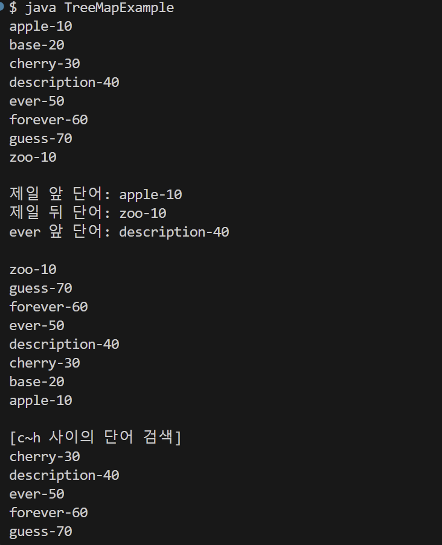

3. Comparable과 Comparator

1) Comparable 인터페이스

    - Integer, Double, String 타입은 모두 Comparable을 구현하고 있기 때문에 상관없지만, 사용자 정의 객체를 저장할 때는 반드시 Comparable을 구현하고 있어야 한다
    - 클래스가 Comparable을 구현하면, 그 클래스의 객체를 기본 정렬 기준으로 정렬할 수 있습니다.
    - 단일 기준으로 정렬됩니다. (예: 나이, 이름 등 하나의 속성 기준)
    - compareTo() 메서드를 오버라이드하여 정렬 기준을 정의합니다.
    - TreeSet에 저장되는 객체와 TreeMAp에 저장되는 객체는 저장과 동시에 오름차순으로 정렬되는데, 어떤 객체든 정렬될 수 있는 것은 아니고 객체가 Comparable 인터페이스를 구현하고 있어야 가능하다
    - 메소드를 재정의해서 비교 결과를 정수 값으로 리턴해야 한다(주어진 객체와 같으면 0, 객체보다 적으면 음수, 객체보다 크면 양수)

        ``` java
        import java.util.*;

        public class ComparableExample {
            public static void main(String[] args) {
                // TreeSet 컬렉션 생성
                TreeSet<Person> treeSet = new TreeSet<>();

                // 객체 저장
                treeSet.add(new Person("홍길동", 45));
                treeSet.add(new Person("김자바", 25));
                treeSet.add(new Person("박지원", 31));

                // 객체를 하나씩 가져오기
                for(Person person : treeSet) {
                    System.out.println(person.name + " : " + person.age);
                }
            }
        }
        ```
        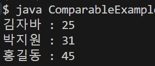

2) Comparator 인터페이스

    - Comparator 인터페이스는 클래스 외부에서 객체의 정렬 기준을 정의할 수 있도록 한다
    - 클래스를 수정하지 않고, 외부에서 정렬 기준을 정의할 수 있습니다.
    - 여러 가지 정렬 기준을 정의할 수 있습니다. (예: 나이, 이름, 점수 등 다양한 기준)
    - compare() 메서드를 구현하여 정렬 기준을 정의합니다.

        ``` java
        import java.util.Comparator;

        public class FruitComparator implements Comparator<Fruit> {
            @Override
            public int compare(Fruit o1, Fruit o2) {
                if(o1.price < o2.price) return -1;
                else if(o1.price == o2.price) return 0;
                else return 1;
            }
        }
        import java.util.TreeSet;

        public class ComparatorExample {
            public static void main(String[] args) {
                // 비교자를 제공한 TreeSet 컬렉션 생성
                TreeSet<Fruit> treeSet = new TreeSet<Fruit>(new FruitComparator());

                // 객체 저장
                treeSet.add(new Fruit("포도", 3000));
                treeSet.add(new Fruit("수박", 10000));
                treeSet.add(new Fruit("딸기", 6000));

                // 객체를 하나씩 가져오기
                for(Fruit fruit : treeSet) {
                    System.out.println(fruit.name + " : " + fruit.price);
                }
            }
        }
        ```

        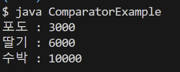

## 6. LIFO와 FIFO 컬렉션

1. Stack

    - Stack 클래스는 LIFO(List In, First Out) 자료구조를 구현한 클래스이다
    - 스택을 응용한 대표적인 예가 JVM 스택 메모리로 스택 메모리에 저장된 변수는 나중에 저장된 것부터 제거된다
    - 주요 메서드

        | 리턴 타입 | 메소드 | 설명 |
        | --------- | ----- | ---- |
        | E | push(E item) | 주어진 객체를 스택에 넣는다 |
        | E | pop() | 스택의 맨 위 객체를 빼낸다

        ``` java
        // Coin.java
        public class Coin {
            private int value;

            public Coin(int value) {
                this.value = value;
            }

            public int getValue() {
                return value;
            }
        }

        // StackExample.java
        import java.util.Stack;

        public class StackExample {
            public static void main(String[] args) {
                // Stack 컬렉션 생성
                Stack<Coin> coinBox = new Stack<Coin>();

                // 동전 넣기
                coinBox.push(new Coin(100));
                coinBox.push(new Coin(50));
                coinBox.push(new Coin(500));
                coinBox.push(new Coin(10));

                // 동전을 하나씩 꺼내기
                while(!coinBox.isEmpty()) {
                    Coin coin = coinBox.pop();
                    System.out.println("꺼내온 동전 : " + coin.getValue() + "원");
                }
            }
        }

        /* 실행 결과
        꺼내온 동전 : 10원
        꺼내온 동전 : 500원
        꺼내온 동전 : 50원
        꺼내온 동전 : 100원
        */
        ```

2. Queue

    - Queue 인터페이스는 FIFO(First In, First Out) 자료구조에서 사용되는 메소드를 정의하고 있다
    - 큐를 응용한 대표적인 예가 스레드풀(ExecutorService)의 작업 큐로 먼저 들어온 작업부터 처리한다(스레드풀은 제한된 수의 스레드를 미리 생성해 두고, 들어오는 작업을 처리하는 구조)

        ``` java
        // Message.java
        public class Message {
            public String command;
            public String to;

            public Message(String command, String to) {
                this.command = command;
                this.to = to;
            }
        }

        // QueueExample.java
        import java.util.*;

        public class QueueExample {
            public static void main(String[] args) {
                // Queue 컬렉션 생성
                Queue<Message> messageQueue = new LinkedList<>();

                // 메시지 넣기
                messageQueue.offer(new Message("sendMail", "홍길동"));
                messageQueue.offer(new Message("sendSMS", "신용권"));
                messageQueue.offer(new Message("sendKakaotalk", "김자바"));

                // 메시지를 하나씩 꺼내어 처리
                while(!messageQueue.isEmpty()) {
                    Message message = messageQueue.poll();
                    switch(message.command) {
                        case "sendMail":
                            System.out.println(message.to + "님에게 메일을 보냅니다.");
                            break;
                        case "sendSMS":
                            System.out.println(message.to + "님에게 SMS를 보냅니다.");
                            break;
                        case "sendKakaotalk":
                            System.out.println(message.to + "님에게 카카오톡을 보냅니다");
                            break;
                    }
                }
            }
        }

        /* 실행 결과
        홍길동님에게 메일을 보냅니다
        신용권님에게 SMS를 보냅니다
        김자바님에게 카카오톡을 보냅니다
        */
        ```

## 7. 동기화된 컬렉션

- ArrayList, HashSet, HashMap을 멀티 스스레드 환경에서 사용하고 싶을 때를 대비해서 컬렉션 프레임워크는 비동기화된 메소드르 동기화된 메소드로 래핑하는 Collections의 synchronizedXXX() 메소드를 제공한다

    | 리턴타입 | 메소드(매개변수) | 설명 |
    | ------- | --------------- | ---- |
    | List<T> | synchronizedList(List<T> list) | List를 동기화된 List로 리턴 |
    | Map<K, V> | synchronizedMap(Map<K, V> m) | Map을 동기화된 Map으로 리턴 |
    | Set<T> | synchronizedSet(Set<T> s) | Set을 동기화된 Set으로 리턴 |

    ``` java
    import java.util.*;

    public class SynchronizedMapExample {
        public static void main(String[] args) {
            // Map 컬렉션 생성
            Map<Integer, String> map = Collections.synchronizedMap(new HashMap<>());    // 동기화된 Map 컬렉션 생성

            // 작업 스레드 객체 생성
            Thread threadA = new Thread() {
                @Override
                public void run() {
                    // 객체 1000개 추가
                    for(int i = 1; i <= 1000; i++) {
                        map.put(i, "내용" + i);
                    }
                }
            };

            // 작업 스레드 객체 생성
            Thread threadB = new Thread() {
                @Override
                public void run() {
                    // 객체 1000개 추가
                    for(int i = 1001; i <= 2000; i++) {
                        map.put(i, "내용" + i);
                    }
                }
            };

            // 작업 스레드 실행
            threadA.start();
            threadB.start();

            // 작업 스레드들이 모두 종료될 때까지 메인 스레드를 기다리게 함
            try {
                threadA.join();
                threadB.join();
            } catch(Exception e) {}

            // 저장된 총 객체 수 얻기
            int size = map.size();
            System.out.println("총 객체 수: " + size);
            System.out.println();
        }
    }
    ```

    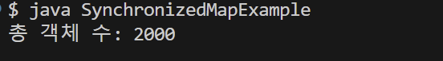

## 8. 수정할 수 없는 컬렉션

- 요소를 추가, 삭제할 수 없는 컬렉션으로 생성 시 저장된 요소를 변경하고 싶지 않을 대 유용하다
- 여러 가지 방법이 있다
        
    1. List, Set, Map 인터페이스의 정적 메소드인 of()로 생성할 수 있다

        ``` java
        List<E> immutableList = List.of(E... elements);
        Set<E> immutableSet = Set.of(E... elements);
        Map<E> immutableMap = Map.of(K k1, V v1, K k2, V v2);
        ```
    
    2. List, Set, Map 인터페이스의 정적 메소드인 copyOf()을 이용해 기존 컬렉션을 복사하여 수정할 수 없는 컬렉션을 만든다

        ``` java
        List<E> immutableList = List.copyOf(Collection<E> coll);
        Set<E> immutableSet = Set.copyOf(Collection<E> coll);
        Map<K, V> immutableMap = Map.copyOf(Map<K, V> map);
        ```
    
    3. 배열로부터 수정할 수 없는 List 컬렉션 만들기

        ``` java
        String[] arr = { "A", "B", "C" };
        List<String> immutableList = Arrays.asList(arr);
        ```
    
    ``` java
    // 수정할 수 없는 컬렉션을 생성하는 방법의 다양한 예시
        import java.util.*;

        public class ImmutableExample {
            public static void main(String[] args) {
                // List 불변 컬렉션 생성
                List<String> immutableList1 = List.of("A", "B", "C");
                // immutableList1.add("D"); (x)

                // Set 불변 컬렉션 생성
                Set<String> immutableSet1 = Set.of("A", "B", "C");
                // immutableSet1.add("D"); (x)

                // Map 불변 컬렉션 생성
                Map<String, Integer> immutableMap1 = Map.of("A", 1, "B", 2, "C", 3);
                // immutableMap1.put("D", 4); (x)

                // List 컬렉션을 불변 컬렉션으로 복사
                List<String> list = new ArrayList<>();
                list.add("A");
                list.add("B");
                list.add("C");
                List<String> immutableList2 = List.copyOf(list);

                // Set 컬렉션을 불변 컬렉션으로 복사
                Set<String> set = new HashSet<>();
                set.add("A");
                set.add("B");
                set.add("C");
                Set<String> immutableSet2 = Set.copyOf(set);

                // Map 컬렉션을 불변 컬렉션으로 복사
                Map<String, Integer> map = new HashMap<>();
                map.put("A", 1);
                map.put("B", 2);
                map.put("C", 3);
                Map<String, Integer> immutableMap2 = Map.copyOf(map);

                // 배열로부터 List 불변 컬렉션 생성
                String[] arr = {"A", "B", "C"};
                List<String> immutableList3 = Arrays.asList(arr);
            }
        }
        ```
        