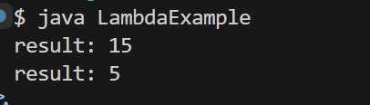
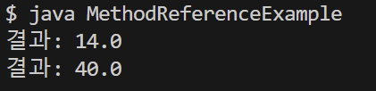

# 1. 람다식

## 1. 람다식이란?

- 자바는 함수형 프로그래밍을 위해 Java8부터 람다식(Lambda Expression)을 지원한다
- 함수형 프로그래밍이란 함수를 정의하고 이 함수를 데이터 처리부로 보내 데이터를 처리하는 기법을 말한다
- 람다식은 데이터 처리부에 제공되는 함수 역할을 하는 매개변수를 가진 중괄호 블록이다
- 데이터 처리부는 람다식을 받아 매개변수에 데이터를 대입하고 중괄호를 실행시켜 처리한다
- 인터페이스의 익명 구현 객체를 람다식으로 표현하려면 인터페이스가 단 하나의 추상 메소드만 가져야 한다(어떤 메서드를 구현하는지 알 수 없으니까)
- 인터페이스가 단 하나의 추상 메소드를 가질 때, 이를 함수형 인터페이스(functional interface)라고 하는데 이를 보장하기 위해서 @FunctionalInterface 어노테이션을 붙이면 된다(컴파일 과정에서 추상 메소드가 하나인지 검사하기 때문)


    ``` java
    @FunctionalInterface
    public interface Calculable {
        // 추상 메소드
        void calculate(int x, int y);
    }


    public class LambdaExample {
        public static void main(String[] args) {
            action((x, y) -> {
                int result = x + y;
                System.out.println("result: " + result);
            });

            action((x, y) -> {
                int result = x - y;
                System.out.println("result: " + result);
            });
        }

        public static void action(Calculable calculable) {
            int x = 10;
            int y = 5;
            calculable.calculate(x, y);
        }
    }
    ```

    


## 2. 메소드 참조

- 메소드를 참조해서 매개변수의 정보 및 리턴 타입을 알아내 람다식에서 불필요한 매개변수를 제거하는 것을 목적으로 한다

1. 정적 메소드와 인스턴스 메소드 참조

    - 정적 메소드를 참조할 경우에는 클래스 이름 뒤에 :: 기호를 붙이고 정적 메소드 이름을 기술한다 (클래스 이름 :: 메소드)

    - 인스턴스 메소드일 경우에는 먼저 객체를 생성한 다음 참조 변수 뒤에 :: 기호를 붙이고 인스턴스 메소드 이름을 기술한다 (참조 변수 :: 메소드)

    ``` java
    // Calcuable.java
    @FunctionalInterface
    public interface Calcuable {
        double calc (double x, double y);
    }

    // Person.java
    public class Person {
        public void action(Calcuable, calcuable) {
            double result = calcuable.calc(10, 4);
            System.out.println("결과: " + result);
        }
    }

    // Computer.java
    public class Computer {
        public static double staticMethod(double x, double y) {
            return x + y;
        }
        public double instanceMethod(double x, double y) {
            return x * y;
        }
    }

    // MethodReferenceExample.java
    public class MethodReferenceExample {
        public static void main(String[] args) {
            Person person = new Person();

            // 정적 메소드 일 경우
            // 람다식
            // person.action((x, y) -> Computer.staticMethod(x, y));
            // 메소드 참조
            person.action(Computer :: staticMethod);

            // 인스턴스 메소드 일 경우
            // 람다식
            // person.action((x, y) -> com.instanceMethod(x, y));
            // 메소드 참조
            person.action(com :: instanceMethod);
        }
    }
    ```

    

2. 생성자 참조

    - 생성자를 참조한다는 것을 객체를 생성하는 것을 의미한다
    - 생성자 참조는 클래스 이름 뒤에 :: 기호를 붙이고 new 연산자를 기술하면 된다(클래스 :: new)
    - 생성자가 오버로딩되어 여러 개가 있을 경우, 컴파일러는 함수형 인터페이스의 추상 메소드와 동일한 매개변수 타입과 개수를 가지고 있는 생성자를 찾아 실행한다

        ``` java
        // Creatable 1 인터페이스
        @FunctionalInterface
        public interface Creatable1 {
            public Member create(String id);
        }

        // Creatable 2 인터페이스
        @FunctionalInterface
        public interface Creatable2 {
            public Member create(String id, String name);
        }

        // Member 클래스(생성자 두가지 만들기, toString 재정의)
        public class Member {
            private String id;
            private String name;

            public Member(String id) {
                this.id = id;
                System.out.println("Member(String id)");
            }

            public Member(String id, String name) {
                this.id = id;
                this.name = name;
                System.out.println("Member(Stirng id, String name)")
            }

            @Override
            public String toString() {
                String info = "{ id: " + id + ", name: " + name + " }";
                return info
            }
        }

        // Person 클래스
        public class Person {
            public Member getMember1(Creatable1 creatable) {
                String id = "winter";
                Member member = creatable.create(id);
                return member;
            }

            public Member getMember2(Creatable2 creatable) {
                String id = "winter";
                String name = "한겨울";
                Member member = creatable.create(id, name);
                return member;
            }
        }

        // ConstructorReferenceExample.java
        public class ConstructorReferenceExample {
            public static void main (String[] args) {
                Person person = new Person();

                Member m1 = person.getMember1(Member :: new);
                System.out.println(m1);
                System.out.println();

                Member m2 = person.getMember2(Member :: new);
                System.out.println(m2);
            }
        }
        ```

## 3. 람다식과 메소드 참조 비교하기

| 특징 | 람다식 | 메소드 참조 |
| ---- | ----- | ----------- |
| 표현 방식 | 함수의 동작을 직접 정의(a -> a.method()) | 메서드를 참조하여 간접적으로 사용(class::method) |
| 가독성 | 간결하지만 복잡한 동작에서는 코드 길어질 수 있음 | 더 간결하고 직관적 |
| 사용 가능 조건 | 모든 함수형 인터페이스에 적용 가능 | 메서드 시그니처가 일치해야 함 |