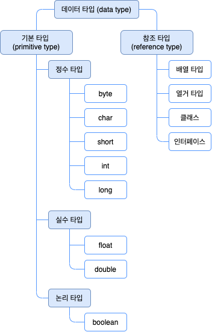
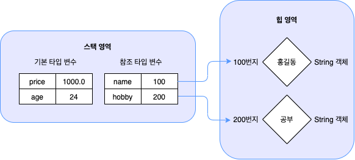
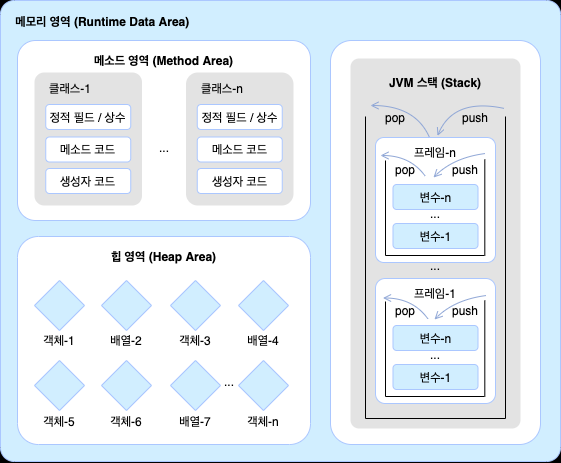

# 1. 객체지향 프로그래밍

## 1. 데이터 타입 분류

- 자바의 데이터 타입은 크게 기본타입(privitive type)과 참조타입(reference type)으로 분류된다

    

- 차이점 : 저장되는 값!!
    - 기본 타입으로 선언된 변수는 값 자체를 저장
    - 참조 타입으로 선언된 변수는 객체가 생성된 메모리 번지를 저장
    - 변수들은 모두 스택(Stack)이라는 메모리 영역에 생성되고 기본 타입 변수는 직접 값을 저장하지만, 참조 타입 변수는 힙 메모리 영영긩 String 객체 번지를 저장하고 이 번지를 통해 String 객체를 참조한다

    

## 2. 메모리 사용 영역

- java 명령어로 JVM이 구동되면 JVM은 운영체제에서 할당받은 메모리 영역을 다음과 같이 구분해서 사용한다

1. 메소드(Method) 영역

- 바이트코드 파일을 읽은 내용이 저장되는 영역
- 클래스별로 상수(final로 선언된 값), 정적 필드(static 변수수), 메소드 코드, 생성자 코드 등이 저장

2. 힙(Heap) 영역

- 객체가 생성되는 영역
- 프로그램이 실행되는 동안 계속 사용된다
- 여기서 생성된 객체는 메모리에서 필요 없어질 때(다른 곳에서 참조하지 않을 때) 자동으로 제거(가비지 컬렌션)
- 객체의 번지는 메소드 영역과 스택 영역의 상수와 변수에서 참조할 수 있다

3. 스택(Stack) 영역

- 메소드를 호출할 때마다 (그 메소드에 필요한 메모리를 임시로 저장하는 공간)성되는 프레임(Frame)이 저장되는 영역
- 메소드가 실행되면서 사용하는 변수와 정보들이 스택 영역에 쌓이고, 메소드가 끝나면 자동으로 제거된다
- 프레임 내부에는 로컬 변수 스택이 있는데, 여기에서 기본 타입 변수와 참조 타입 변수가 생성되고 제거된다다

    

