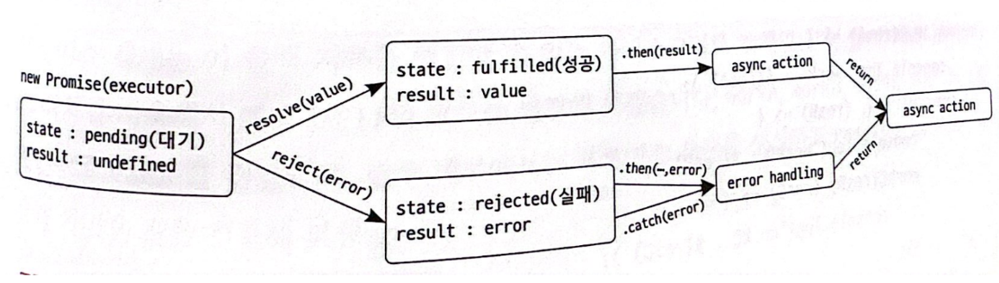
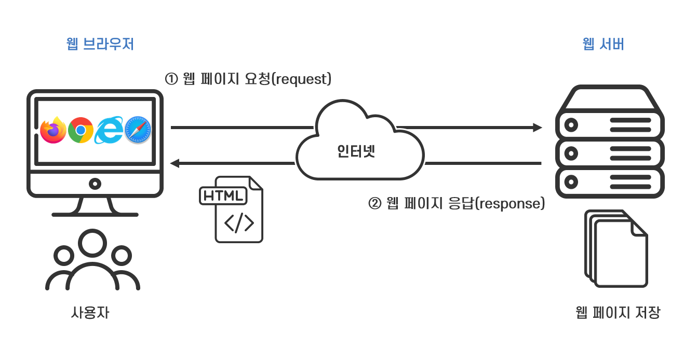

# 1. 자바 스크립트의 비동기 처리

- 비동기란 무엇이고 어떻게 사용할 수 있는지
- 비동기와 관련된 자바스크립트의 Promise 객체와 async/await에 대해 알아보기
- 실제 비동기를 사용하는 대표적인 기능인 서버와 데이터를 주고 받는 기능 개발

## 1. 동기와 비동기

- 동기 : 하나의 작성이 완료될 때까지 다른 작업을 실행하지 않고 앞의 작업이 끝나야 다음 작업을 할 수 있는 순차적인 방식

    ``` javascript

    // 동기적으로 동작하는 코드
    console.log(1);
    console.log(2);
    console.log(3);
    ```

- 비동기 : 동기와 반대되는 개념으로, 어떠한 작업이 종료되기를 기다리지 않고 그 다음 작업을 병렬적으로 수행하는 방식

### 1. 동기, 비동기 처리

- 실제 애플리케이션을 개발할 때 모든 작업을 동기적으로 처리한다면 이전 작업이 처리될 때까지 걸리는 시간이 10초든 10분이든 계속 대기해야 한다
- 예를 들어 이미지 로드라는 하나의 작업이 완료될 때까지 버튼 클릭 등과 같은 다른 작업이 수행되지 않을 것이고, 많은 사람은 이를 오류가 발생했다고 인식할 것이다
- 여러 작업을 비동기적으로 처리하면, 하나의 작업이 처리될 때까지 시간이 얼마나 걸리든 대기하지 않고 다른 작업을 처리할 수 있어 훨씬 더 좋은 사용자 경험을 줄 수 있다
- 자바 스크립트는 싱글 스레드 언어
    1. 자바스크립트에서 이렇게 어떠한 작업을 수행하는 또는 처리하는 주체를 스레드라고 한다
    2. 하나의 스레드에서 여러 작업을 병렬적으로 처리할 수 있도록 비동기식으로 작업을 처리한다
    3. 그러면 여러개의 스레드에서 작업을 하면 안되냐 할텐데 자바스크립트는 싱글 스레드 방식으로 실행되는 언어라 멀티 스레드 방식으로 작업할 수 없고 비동기 방식으로 작업을 처리해야 한다


### 2. setTimeout

- 가장 기본적인 방법은 setTimeout() 내장 함수를 사용하는 방법이다
- setTimeout 내장 함수에는 콜백 함수와 delayTime이라는 두 개의 매개변수가 들어간다
- setTimeout 내장 함수를 사용하면, 전달된 콜백함수를 전달된 delayTime(ms)만큼 기다린 후에 수행된다

    ``` javascript
    // setTimeout 함수의 구조
    setTimeout(() => {
        // code
    }, delayTime);

    // setTimeout 함수 아래에 다른 코드를 작성한 후 출력하기
    setTimeout(() => {
        console.log("자바스크립트")
    }, 3000);
    console.log("종료");        // 종료 자바스크립트 순으로 출력된다
    ```

## 2. 프로미스 객체

### 1. 생성 및 사용법

- 자바스크립트에는 특정 작업을 비동기로 처리할 때 사용하는 객체인 프로미스(Promis)라는 객체가 있습니다
- 프로미스 객체는 new 키워드와 생성자를 사용해 생성한다
- 프로미스 객체는 객체 생성 시 인수로 excutor라는 실행 함수를 전달하고, 실행 함수에는 매개변수로 resolve와 reject라는 콜백함수를 전달한다

    ``` javascript
    // 프로미스 객체 생성하기
    const executor = (resolve, reject) => {
        // 코드
    };
    const promise = new Promise(excutor);
    console.log(promise);       // Promise {<pending>}
    ```

- excutor(실행 함수)란 프로미스 생성자에 반드시 전달해야 하는 함수로, 프로미스 객체가 생성될 때 자동으로 실행되는 함수이다
- 프로미스 객체가 생성됨과 동시에 excutor가 실행되고, excutor에서 원하는 작업이 처리된다
- 프로미스 객체의 excutor는 작업 처리의 성공 여부에 따라 성공했을 경우 resolve가, 실패했을 경우 reject가 호출된다

### 2. resolve와 reject
 
1. 프로미스 객체가 생성되면 바로 executor가 실행되고, 이때 state와 result 프로퍼티는 값으로 각각 pending(대기)과 undefined를 갖는다
2. 만약 특정 작업이 성공해서 resolve 함수가 호출되면, state는 fulfilled(성공)의 값을 갖고, result는 resolve 함수에 전달된 value의 값을 갖습니다
3. 반대로 특정 작업이 실패해서 reject 함수가 호출된다면, state는 rejected(실패), 그리고 result는 error로 변합니다
4. 프로미스 객체는 then 메서드를 사용해 resolve와 reject 함수에 전달된 값을 가져올 수 있다
5. 작업이 성공한 경우 실패해 에러가 발생한 경우를 나눠서 처리하고 싶다면, then/catch 메서드를 사용해 좀 더 직관적으로 처리할 수 있다

    ``` javascript
    // 프로미스 객체의 then/catch 메서드를 사용한 에러 핸들링
    const executor = (resolve, reject) => {
        setTimeout(() => {
            resolve("성공");
            reject("실패");
        }, 3000);
    };

    const promise = new Promise(executor);
    promise
        .then((result) => {
            console.log(result);
        })
        .catch((error) => {
            console.log(error);
        });
    ```

    

### 3. 콜백 지옥

- ">" 모양으로 복잡하게 작성된 코드
- 프로미스를 사용하는 가장 대표적인 이유는 자바스크립트의 비동기 처리 방식의 문제점 중 하나인 콜백 지옥을 해결할 수 있기 때문

    ``` javascript
    // 콜백지옥 예시
    function prepareFood(callback) {
    setTimeout(() => {
        console.log("1. 재료 준비 완료");
        callback();
    }, 1000);
    }

    function cookFood(callback) {
    setTimeout(() => {
        console.log("2. 요리 조리 완료");
        callback();
    }, 1000);
    }

    function serveFood(callback) {
    setTimeout(() => {
        console.log("3. 요리 서빙 완료");
        callback();
    }, 1000);
    }

    // 콜백 지옥 형태
    prepareFood(() => {
    cookFood(() => {
        serveFood(() => {
        console.log("4. 손님에게 서빙 완료");
        });
    });
    });

    // Promise로 개선
    function prepareFood() {
    return new Promise((resolve) => {
        setTimeout(() => {
        console.log("1. 재료 준비 완료");
        resolve();
        }, 1000);
      });
    }

    function cookFood() {
    return new Promise((resolve) => {
        setTimeout(() => {
        console.log("2. 요리 조리 완료");
        resolve();
        }, 1000);
      });
    }

    function serveFood() {
    return new Promise((resolve) => {
        setTimeout(() => {
        console.log("3. 요리 서빙 완료");
        resolve();
        }, 1000);
      });
    }

    // Promise 체이닝으로 더 간결하게
    prepareFood()
    .then(() => cookFood())
    .then(() => serveFood())
    .then(() => {
        console.log("4. 손님에게 서빙 완료");
    });
    ```

- 프로미스 체이닝(Promis Chaining) : 프로미스 객체를 반환해 then 메서드를 연속으로 사용하는 방식
- 프로미스 체이닝을 사용해 코드를 작성하면 코드를 아래쪽으로 계속 작성할 수 있기 때문에 훨씬 더 직관적으로 코드를 해석할 수 있고 정리할 수 있다


## 3. async와 await

### 1. async

- async는 비동기 작업을 포함하고 있는 프로미스 객체를 반환하는 함수에 작성하는 키워드이기 때문에, async를 작성하면 코드를 훨씬 직관적으로 해석할 수 있다

    ``` javascript
    // async를 사용해 코드 수정하기
    const delay = (ms) => {
        return new Promise((resolve) => {
            setTimeout(() => {
                resolve(`${ms/1000}초가 지났습니다.`);
            }, ms);
        });
    };

    const start = async() => {
        delay(3000).then((res) => {
            console.log(res);
        });
    };

    start();        // 3초가 지났습니다
    ```

### 2. await

- await은 async 키워드가 작성된 함수의 내부에서 사용하는 키워드이다
- await 키워드가 포함된 코드가 실행되면, 프로미스 객체가 처리될 때까지 함수의 실행을 기다리게 만드는 역할을 하고, 프로미스 객체의 처리가 완료될 때까지는 자바스크립트 엔진이 다른 작업을 처리할 수 있기 때문에 효율적인 프로그래밍할 수 있게 도와준다
- await를 사용해 코드를 작성하면 프로미스 객체의 then 메서드를 사용해 코드를 작성하는 것보다 코드를 훨씬 더 가독성이 좋고 편리하게 작성할 수 있다

    ``` javascript
    // await를 사용해 코드 수정하기
    const delay = (ms) => {
        return new Promise((resolve) => {
            setTimeout(() => {
                resolve("javascript");
            }, ms);
        });
    };

    const start = async () => {
        let result = await delay(3000);
        console.log(result);
    };

    start();
    ```

### 3. 에러 핸들링

- async와 await를 이용한 비동기 처리에서는 try와 catch 문법을 사용해 보다 간단하게 에러 처리를 할 수 있다

    ``` javascript
    // try, catch를 사용한 에러 핸들링
    const delay = (ms) => {
        return new Promise((resolve) => {
            setTimeout(() => {
                resolve("javascript");
            }, ms);
        });
    };

    const start = async() => {
        try {
            let result = await delay(3000);
            console.log(result);
        } catch(error) {
            console.log(error);
        };
    };

    start();
    ```

## 4. API

- 비동기처리는 대표적으로 웹사이트에서 데이터를 주고받는 통신을 할 때 사용

### 1. 클라이언트와 서버 통신

- 웹사이트는 웹브라우저에서 네트워크를 통해 데이터나 서비스를 제공하는 컴퓨터인 서버와 통신한다
- 웹브라우저는 네트워크로 연결된 서버로부터 정보를 제공받는 컴퓨터인 클라이언트라고 할 수 있더
- 클라이언트와 서버의 데이터 통신은 우리가 웹이나 앱을 이요할 때 원하는 데이터를 요청하고 전달받기까지의 과정을 뜻한다

    

### 2. API와 JSON

- 웹 브라우저는 API를 사용해서 웹사이트에 필요한 데이터를 요청하고 전달받는다
- API 호출을 하기 위해서는 가장 먼저 API 호출에 응답할 수 있는 서버가 필요하다
- 서버를 직접 제작하고 API를 호출할 수도 있지만, 편의를 위해서 여러 가지 API 예제를 무료로 제공하는 JSONplaceholde라는 서비스 이용
- 사이트 : https://jsonplaceholder.typicode.com/

    ``` javascript
    [
        {
            "userId": 1,
            "id": 1,
            "title": "sunt aut facere repellat provident occaecati excepturi optio reprehenderit",
            "body": "quia et suscipit\nsuscipit recusandae consequuntur expedita et cum\nreprehenderit molestiae ut ut quas totam\nnostrum rerum est autem sunt rem eveniet architecto"
        },
        {
            "userId": 1,
            "id": 2,
            "title": "qui est esse",
            "body": "est rerum tempore vitae\nsequi sint nihil reprehenderit dolor beatae ea dolores neque\nfugiat blanditiis voluptate porro vel nihil molestiae ut reiciendis\nqui aperiam non debitis possimus qui neque nisi nulla"
        }
    ]
    ```

- API는 API 주소(API URL)를 통해 호출할 수 있고, API 주소를 사용해 API를 호출하면 서버는 화면에 표시된 데이터를 전달한다
- 데이터는 한 개의 배열로 이루어지고, 배열 안에는 각각의 데이터가 객체 형태로 저장되어 있다
- 이러한 자바스크립트의 데이터 구조를 JSON이라고 부른다
- JSON은 자바스크립트 객체 표기법이라는 뜻으로, js에서 데이터를 문자열 형태로 나타내기 위해 사용되고, key & value 쌍으로 이루어진다

### 3. API 호출과 비동기

- 자바스크립트에서는 fetch라는 내장 함수를 사용해 API를 호출할 수 있습니다
- fetch 내장 함수 안에는 API 주소를 작성합니다
- 프로미스 객체를 반환하는 함수는 비동기 처리 함수이고, 이러한 함수는 then 메서드를 사용해 결괏값을 출력할 수 있다
- JSON 형태의 데이터는 자바스크립트에서 객체 형태의 데이터를 가독성 좋게 나타내기 위한 하나의 표기법으로, 자바스크립트에서 JSON 데이터를 활용하기 위해서는 JSON 문자열을 파싱해서 객체 형태로 변환해야 한다다

    ``` javascript
    // 1. then과 catch를 사용한 에러 핸들링
    const response = fetch("https://jsonplaceholder.typicode.com/posts")
    .then((res) => console.log(res))
    .catch((error) => console.log(error));

    console.log(response);

    // console

    /*
    Promise {<pending>}
    Response {type: "cors", url: "https://jsonplaceholder.typicode.com/posts", redirected:raise, status: 200, ok: true}

    fetch를 사용해 API를 호출하면 우리가 페이지에서 봤던 데이터가 아니라 API 성공 객체 그 자체를 반환하기 때문에 수정해야 한다
    */

    // 2. async와 await를 사용해 API 호출하기 & API 호출 결괏값 json으로 파싱하기

    const getDate = asyns() => {
        const response = await fetch("https://jsonplaceholder.typicode.com/posts");
        const data = await response.json();
        console.log(data);
    };

    getDate();      // (100) [Object, Object, Object, ...]
    ```

### 4. API 에러 핸들링

- 데이터를 요청할 때는 다른 서버 프로그램에 데이터를 요청하는 경우가 많기 때문에 네트워크 오류 혹은 인터넷 속도 드으이 다양한 이유로 실패하는 경우가 발생한다
- API 호출처럼 성공할 수도 혹은 실패할 수도 있는 작업이 언제 종료될지 모르는 작업은 모두 비동기로 처리해야하고 오류가 발생할 상황에 대비해 에러 처리를 잘해줘야 한다

    ``` javascript
    // try와 catch를 사용한 에러 핸들링
    const getDate = async () => {
        try {
            const response = await fetch("https://jsonplaceholder.typicode.com/posts");
            const data = await response.json();
            console.log(data);
        } catch(error) {
            console.log(`error : ${error}`);
        };
    };

    // 주소를 일부로 잘못 입력한다면... error : TypeError: Failed to fetch가 나옴
    ```
    