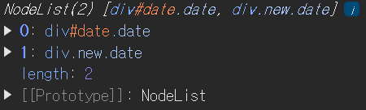
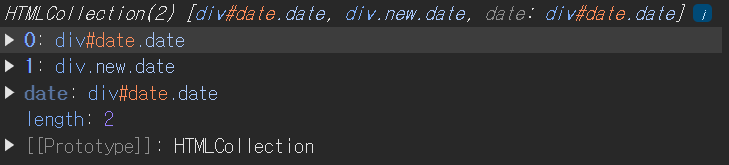
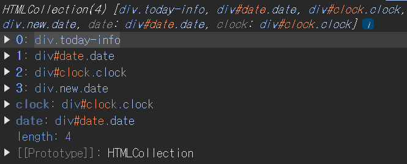
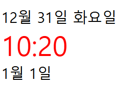
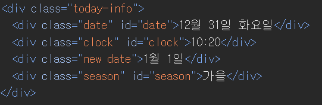
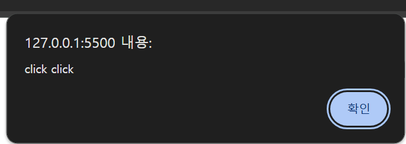

# 1. DOM과 DOM API

- 자바스크립트가 어떻게 웹 페이지를 이루는 요소에 접근하고
- 웹 페이지를 동적으로 만들 수 있는지

## 1. DOM이란?

- 자바스크립트는 DOM을 통해 웹 페이지 요소에 접근할 수 있습니다
- DOM이란 Document Object Moment의 약자고, 문서 객체 모델입니다
- 문서 객체 모델이란 HTML로 작성된 여러 가지 요소에 자바스크립트가 접근하고 조작할 수 있도록 브라우저가 변환시킨 객체를 말합니다

### 1. 웹의 구성 요소

- 웹이란 인터넷에 연결된 사용자들이 서로의 정보를 공유할 수 있는 공간
- 웹에서 HTML로 작성된 페이지를 웹 페이지라고 부르고, 웹 페이지가 여러 개 모여 있는 웹 페이지의 집합을 웹사이트(홈페이지)라고 부른다
- 이러한 웹 사이트는 보통 HTML, CSS, JavaScript로 이루어져 있다
    1. HTML(Hyper Text Markup Language) : 브라우저에 웹 페이지의 요소들이 어떻게 구성되어 있는지를 알려주는 역할
    2. CSS(Cascading Style Sheets) : 웹 페이지의 요소를 꾸며주는 역할을 하는 시트(Sheet)
    3. JavaScript : 웹 요소들을 생성 및 삭제, 변형

### 2. DOM과 DOM 트리

- DOM은 웹 브라우저가 HTML로 작성된 요소들을 자바스크립트가 이용할 수 있는 객체로 변경한 형태
- 웹 브라우저는 HTML 문서를 불러온 다음, 요소 간의 상하관계를 한눈에 볼 수 있는 트리 구조로 나타내는데, 이를 DOM 트리라고 부른다

    

- DOM 트리에서 네모 박스는 HTML로 작성된 태그로, 이 태그 요소 하나 하나를 노드(Node)라고 부르며, 이 노드는 전부 하나의 객체로 이루어져 있다
- 웹 브라우저는 이러한 DOM 트리를 통해 웹 요소를 웹 페이지에 나타낼 수 있고, 자바스크립트는 웹 페이지를 조작할 때 이 객체들을 사용한다


## 2. DOM API

- DOM은 자바스크립트가 DOM에 접근할 수 있게 DOM API를 제공합니다
- DOM API를 이용해 요소들을 조작하기 위해서는 가장 먼저 조작하고자 하는 요소를 찾아 해당 요소를 선택한 다음, 선택된 요소를 조작해야 한다

### 1. 요소 노드 접근

- HTML에서 요소를 작성할 때는 class와 id를 사용해 요소에 이름을 지정한다
- class는 동일한 값을 여러 요소에 적용할 수 있지만, id 값은 고유 값으로, 같은 값을 여러 요소에 지정할 수 없다
- class는 반복적으로 사용되는 스타일을 적용해야 할 때 사용하고, header와 footer 같은 요소나 내부에 있는 세부적인 스타일을 적용할 때는 id를 사용해 이름을 지정한다


1. documert.getElementById(id)

- 특정 요소를 id 값으로 가져온다는 의미로, 실제 특정 요소의 객체 값을 반환한다
- DOM에서 어떤 요소를 찾을 때는 가장 먼저 문서 노드(documetn)에 접근해야한다!
- DOM API를 사용해 특정 요소를 변수에 할당할 때에는 일반적으로 요소를 할당할 변수의 이름 앞에 $ 기호를 붙이거나 변수명 뒤에 Element를 작성한다

    ``` javascript
    // id 값이 date 인 요소에 접근하기
    let $date = document.getElementById("date");
    console.log($date);     // <div ckass="date" id="date">10월 17일 화요일</div>
    ```

2. document.querySelector(cssSelector)

- getElementById처럼 하나의 요소만을 반환하는 API로, 특정 요소의 id 값이 아닌 css 선택자로 요소 노드를 반환하는 API

    ``` javascript
    // div 태그로 감싸여 있는 요소 중 클래스 명이 date인 요소에 접근하기
    let $date = document.querySelector("div.date");
    console.log($date);     // <div class="date" id="date">10월 17일 화요일</div>
    ```

3. documet.querySelectorAll()

- 전달받은 클래스 이름을 갖고 있는 여러 요소들을 전부 찾아 반환하는 DOM API 
- 요소 하나만 출력되지 않고, div 태그로 이루어진 요소들 중 클래스 이름이 해당하는 요소 전부 NodeList에 담겨 출력된다다

    ``` javascript
    // div 태그로 이루어진 요소 중 클래스 명이 date인 모든 요소에 접근하기
    let $date = document.querySelectorAll("div.date");
    console.log($date);
    ```

    


4. document.getElementsByClassName()

- css 선택자가 아닌 클래스 이름만드로 여러 가지 요소를 찾는 DOM API
- 반환하는 HTMLCollection이 DOM에 실시간으로 반응한다

    ``` javascript
    // 클래스 명이 date인 모든 요소에 접근하기
    let $date = document.getElementsByClassName("date");
    console.log($date);
    ```

    

5. document.getElementsByTagName()

- div, img와 같은 특정 태그로 이루어진 여러 요소를 출력할 수 있다

    ``` javascript
    // 태그 이름이 div인 모든 요소에 접근하기
    let $div = document.getElementsByTagName("div");
    console.log($div);
    ```

    

### 2. DOM 노드 값 조작

1. className

- 요소의 클래스 이름 변경하기
- getElementById를 사용해 id 값이 해당하는 노드에 접근하고, className이라는 프로퍼티를 사용해 요소의 클래스 명 변경하기

    ``` javascript
    // $clock 요소의 클래스 명 변경하기
    let $clock = document.getElementById("clock");
    $clock.className = "new clock";
    console.log($clock.className);      // new clock
    ```

2. id

- id라는 프로퍼티를 사용해서 요소 노드의 id 값 변경하기

    ``` javascript
    // $clock 요소의 id 값 수정하기
    let clockElement = document.querySelector("div.clock");
    clockElement.id = "new-clock";
    console.log($clockElement.id);  // new-clock
    ```

3. classList

- className처럼 특정 요소의 클래스 속성에 접근 가능한 프로퍼티지만, add, contains, item과 같은 여러 가지 메서드를 제공한다

    ``` javascript
    // classList의 add 메서드를 사용해 클래스 추가하기
    let $clock = document.getElementById("clock");
    $clock.classList.add("new");
    console.log($clock);        // <div class="clock new" id="clock"> 10:20 </div>

    // classList의 remove 메서드를 사용해 클래스 삭제하기
    $clock.classList.remove("new");
    console.log($clock);        // <div class="clock" id="clock"> 10:20 </div>
    ```

4. textContent

- textContent를 사용해서 텍스트 노드의 값을 변경

    ``` javascript
    // textContent를 사용해 텍스트 변경하기
    let $clock = document.getElementById("clock");
    $clock.textContent = "12:00";
    console.log($clock.textContent);    // 12:00
    ```

5. style

- style 프로퍼티를 사용해서 원하는 요소의 스타일을 추가, 수정하기

    ``` javascript
    // $clock 요소의 스타일 수정하기
    let $clock = document.getElementById("clock");
    $clock.style.color = "red";
    $clock.style.fontSize = "30px";
    console.log($clock);
    ```

    

### 3. 요소 노드 생성

1. createElement

- createElement는 DOM API를 사용해 새로운 요소 노드를 생성할 수 있다

    ``` javascript
    // class 이름과 id 값이 season인 요소 생성하기
    let $season = document.createElement("div");
    $season.className = "season";
    $season.id = "season";
    console.log($season);       // <div class="season" id="season"></div>

    // $season 요소에 텍스트 추가하기
    $season.textContent = "가을";   // <div class="season" id="season">가을</div>

    // createTextNode를 사용해서 텍스트 추가도 가능
    let $seasonText = document.createTextNode("가을");
    console.log($seasonText);   // 가을(요소에 값이 추가되는 것이 아니라 별도의 텍스트 노드가 생성된다)
    ```

2. appendChild

- appendChild를 사용하면 전달받은 노드를 원하는 요소의 마지막 자식으로 추가할 수 있다

    ``` javascript
    // $season 노드 알맞게 추가하기
    let $season = document.createElement("div");
    $season.className = "season";
    $season.id = "season";

    let $seasonText = document.createTextNode("가을");

    let $todayInfo = document.querySelector("div.today-info");
    $season.appendChild($season);
    $season.appendChild($seasonText);
    console.log($todatText);
    ```

    

### 4. 이벤트 설정

1. addEventListener

- DOM은 특정 요소에 여러 가지 이벤트를 추가할 수 있는 addEventListenr라는 DOM API를 제공(e.g. 버튼 요소가 정말 버튼처럼 동작)
- 매개변수로 event와 listener를 받는다
- event는 어떤 이벤트를 발생시킬 것인지를 나타냄
- listener는 앞의 이벤트가 발생했을 때 실행될 함수를 전달받는다

    ```javascript
    // window 객체의 alert 메서드를 사용해서 click 이벤트가 일어나는 addEventListener 만들기
    let $button = document.createElement("button");
    $button.id = "button";
    $button.classList.add("button");
    $button.textContent = "버튼";
    $button.addEventListener("click", () => {
        window.alert("click click");
    });
    // click은 javaScript에서 정해진 이벤트 타입의 이름

    let $todayInfo = document.querySelector("div.today-info");
    $todayInfo.appendChild($button);
    
    console.log($todayInfo);
    ```

    