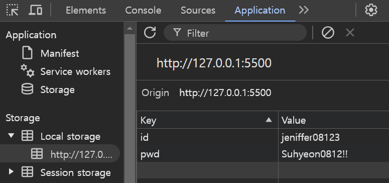
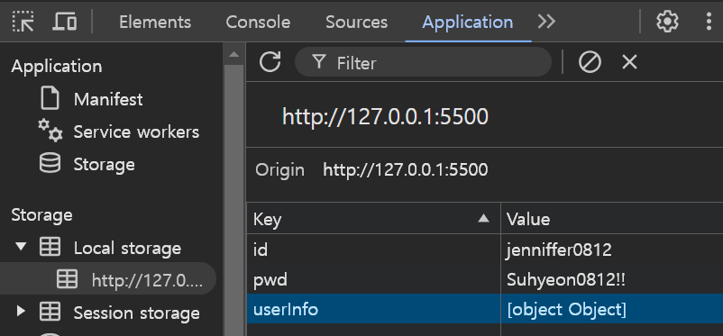
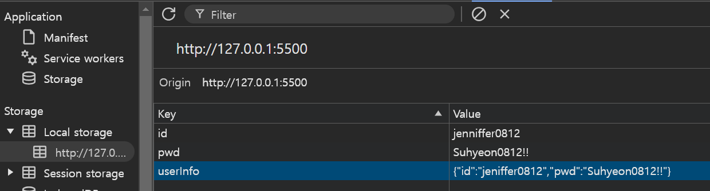

# 1. 실전 프로젝트

## 1. 프로젝트 준비

### 1. 여러 가지 폼 조작

- 폼 요소란 웹 페이지에서 사용자가 정보를 입력할 수 있게 만들어 놓은 웹 요소
- 자주 사용하는 폼 요소에는 input, select, textarea 등이 있다

1. 폼 요소에 접근하기(input, textarea)

    ```html
    <!DOCTYPE html>
    <html lang="en">
    <head>
        <title>form</title>
        <meta charset="UTF-8">
    </head>
    <body>
        <form name="user_info">
            <p>
                <label for="name">이름</label>
                <input type="text" id="name" name="user_name" />
            </p>
            <p>
                <label for="major">전공</label>
                <textarea type="major" id="major" name="user_major"></textarea>
            </p>
        </form>
        <button id="save-btn">저장</button>
        <script src="./index.js"></script>
    </body>
    </html>
    ```

    ``` javascript
    // input 요소와 textarea 요소에 접근하기
    let $input = document.querySelector("#name");           // <input type="text" id="name" name="user_name" />
    let $textArea = document.getElementById("major");       // <textarea type="major" id="major" name="user_major"></textarea>
    let $button = document.getElementById("save-btn");      

    console.log($input);
    console.log($textArea);

    // 저장 버튼을 통해 입력 폼에 입력된 값 출력하기기
    $button.addEventListener("click", () => {
        console.log($input.value);
        console.log($textArea.value);
    });
    ```

2. 폼 요소에 접근하기(select)
    - select 요소를 조작하기 위해서는 사용자가 어떠한 항목을 선택했는지 알아내야 한다
    - event에는 click이 아닌 change를 사용해서 select 요소의 option 값이 변경될 때 변경된 값을 출력해야 한다

    ``` html
    <!DOCTYPE html>
    <html lang="en">
    <head>
        <title>form</title>
        <meta charset="UTF-8">
    </head>
    <body>
        <form>
            <select id="fruits">
                <option>--과일--</option>
                <option value="banana">바나나</option>
                <option value="apple">사과</option>
                <option value="peach">복숭아</option>
                <option value="strawberry">딸기</option>
                <option value="grape">포도</option>
            </select>
        </form>
    </body>
    </html>
    ```

    ``` javascript
    // select 폼에 접근하기
    let $fruits = document.getElementById("fruits");
    console.log($fruits);   // <select id="fruits">...</select>

    // change 이벤트를 사용해 변경된 값 출력하기
    let $fruits = document.getElementById("fruits");

    $fruits.addEventListened("change", () => {
        console.log($fruits.value);
    });     
    ```

### 2. 로컬 스토리지

1. 로컬 스토리지

- 웹 브라우저의 데이터를 저장할 수 있는 저장소와 같은 기능
- 로컬 스토리지를 사용하면 사용자가 브라우저를 종료하더라도 기존에 웹 페이지 내에서 저장한 데이터를 계속 유지할 수 있다
- 보통의 경우 사용자의 로그인 정보나 간단한 설정 등을 저장하기 위해 사용된다(e.g. 로그인에 성공한 아이디를 로컬 스토리지에 저장해 사용자가 다음에 다시 동일한 웹 페이지에 방문했을 때 저장된 아이디를 불러와 사용)
- 로컬 스토리지는 window의 localStorage 객체를 사용해 데이터를 저장하고 가져올 수 있다
- 로컬 스토리지에 저장된 값은 콘솔 탭이 아닌 애플리케이션 탭에서 확인할 수 있다
   
    

    ``` html
    <!DOCTYPE html>
    <html lang="en">
    <head>
        <title>LocalStorage</title>
        <meta charset="UTF-8">
    </head>
    <body>
    <div class="main">
            <input type="text" id="id" />
            <input type="password" id="pwd" />
            <button id="login-btn">로그인</button>
    </div>
    <script src="src/index.js"></script>
    </body>
    </html>
    ```

    ``` javascript
    // 아이디, 비밀번호 입력폼에 입력된 값 출력하기
    const $idInput = document.getElementById("id");
    const $passwordInput = document.getElementById("pwd");
    const $logButton = document.getElementById("login-btn");

    $loginButton.addEventListener("click", () => {
        window.alert("로그인 성공");
        console.log($idInput.value);
        console.log($passwordInput.value);
    })

    // 로컬 스토리지에 원하는 데이터 저장 : localStorage.setItem(keyName(저장할 데이터), keyValue(저장할 데이터의 값)) 
    // localStorage.setItem()을 사용해 아이디, 비밀번호 값 저장하기
    $loginButton.addEventListener("click", () => {
        window.alert("로그인 성공");
        localStorage.setItem("id", $idInput.value);
        localStorage.setItem("pwd", $passwordInput.value);
    })

    // getItem 메서드를 사용해 로컬 스토리지에 저장된 값 출력하기
    $loginButton.addEventListener("click", () => {
        window.alert("로그인 성공");
        localStorage.setItem("id", $idInput.value);
        localStorage.setItem("pwd", $passwordInput.value);
        let myId = localStorage.getItem("id");
        let myPassword = localStorage.getItem("pwd");
        console.log(myId);
        console.log(myPassword);
    });

    // 로그인, 비밀번호를 userInfo로 묶어 로컬 스토리지에 저장하기 : keyName에 여러 개의 데이터를 객체나 배열의 형태로 묶어서 저장하면 getItem를 여러번 사용하지 않아도 된다!
    $loginButton.addEventListener("click", () => {
        window.alert("로그인 성공");
        let userInfo = { id: $idInput.value, pwd: $passwordInput.value };
        localStorage.setItem("userInfo", userInfo);
        console.log(userInfo);
    })

    ```

2. 로컬 스토리지에 객체로 저장하려면

- 자바 스크릡트에서 로컬 스토리지는 텍스트 데이터만 저장할 수 잇기 때문에 객체 혹은 배열 형태의 데이터를 로컬 스토리지에 저장하려면 데이터를 문자열로 변환해야 한다
- 로컬 스토리지를 사용할 때 객체 및 배열 형태의 데이터를 문자열로 변환하기 위해서는 보통 자바스크립트의 내장 객체인 JSON을 사용한다
- JSON 객체에는 특정 문자열을 자바스크립트 객체로 변환하는 JSON.parse(), 특정 객체를 JSON 형태로 변환하는 JSON.stringify() 메서드가 있다

    

    

    ``` javascript
    // JSON.stringify()를 사용해 데이터를 문자열로 변환한 후 로컬 스토리지에 저장하기
    $loginButton.addEventListener("click", () => {
        window.alert("로그인 성공");
        let userInfo = { id: $id.value, pwd: $password.value };
        localStorage.setItem("userInfo", JSON.stringify(userInfo));
    })
    ```

## 2. 프로젝트 개발(나만의 크롬 시작화면)

- 기능

    1. 날짜와 시각을 나타내는 시계
    2. 검색어를 입력하면 검색 결과 페이지로 이동하는 기능
    3. 명언을 하루에 하나씩 불러오는 기능
    4. 북마크를 추가하고 삭제하는 기능

1. 디지털 시계 제작

    ``` js
    //  현재 요일을 가져오고 저장하는 getNowDate, setNowDate 함수를 만들기
    const $date = document.getElementById("today-date");    //  오늘 날짜
    const $time = document.getElementById("now-time");      //  현재 시간

    // 분에 해당하는 숫자를 두 자리로 만들어주는 함수 : modifyNumber
    const modifyNumber = (number) => {
        return number < 10 ? "0" + number : number;
    }

    const setNowDate = (month, date, day) => {
        $date.textContent = `${month}월 ${date}일 ${day}요일`;
    };

    const getNowDate = () => {
        const nowDate = new Date();
        const week = ['일', '월', '화', '수', '목', '금', '토'];
        let month = modifyNumber(nowDate.getMonth() + 1);
        let date = modifyNumber(nowDate.getDate());
        let day = week[nowDate.getDay()];
        setNowDate(month, date, day);
    };

    // 현재 시간을 가져오고 저장하는 getNowTime, setNowTime 함수를 만들기
    const setNowTime = (hour, minute) => {
        $time.textContent = `${hour} : ${minute}`;
    }
    const getNowTime = () => {
        const nowDate = new Date();
        let hour = modifyNumber(nowDate.getHours());
        let minute = modifyNumber(nowDate.getMinutes());
        setNowTime(hour, minute);
    }

    getNowDate();
    getNowTime();
    // 1초마다 현재 시간을 갱신하는 함수 : setInterval(사용하지 않으면 시간이 흐르지 않음)
    setInterval(getNowTime, 1000);
    ```

2. 검색 바 제작

- 어떤 주소로 페이지를 이동시키는 데는 자바스크립트의 window 객체를 사용
- window 객체의 location.href 속성을 사용하면 페이지를 특정 주소의 웹 페이지로 이동시킬 수 있다

    ``` javascript
    const $search = document.getElementById('search-input');

    // 구글 검색 결과 페이지로 이동하는 moveResultPage 함수 만들기
    const moveResultPage = () => {
        let searchWord = $search.value ;
        window.location.href = `https://www.google.com/search?q=${searchWord}`;
        searchWord = '';
    };

    // 검색창에서 엔터키를 누르면 moveResultPage 함수 실행
    const enterKey = (event) => {
        if(event.code === "Enter") {
            moveResultPage();
        }
    };  

    // event는 $search 요소에 addEventListener를 사용해서 특정 키를 누르는 이벤트인 keypress를 통해 받아옴
    $search.addEventListener('keypress', (event) => {
        enterKey(event);
    });
    ```

3. 명언 API 호출
    ``` javascript
    //API 주소 선언 및 명언을 표시할 요소에 접근하기
    const API_URL = `https://random-quote.hyobb.com/`;
    const $quote = document.getElementById('quote');
    const quoteItem = localStorage.getItem('quote');

    // 명언 생성 날짜 가져오기기
    const nowDate = new Date();
    const month = nowDate.getMonth() + 1;
    const date = nowDate.getDate();

    // $quote 요소에 명언 API 결괏값 텍스트로 추가하기
    const setQuote = (result) => {
        let quote = { createdDate: `${month}-${date}`, quoteData: result};
        localStorage.setItem("quote", JSON.stringify(quote));
        $quote.textContent = `"${result}"`;
    }

    // 명언 API 호출 후 결괏값 출력하기 : API 호출은 성공할 수도 실패할 수도 있기 때문에 async/await를 사용해 비동기 처리
    const getQuote = async () => {
        try {
            const data = await fetch(API_URL).then((res) => res.json());
            const result = data[1].respond;
            console.log(result);    // 오랫동안 꿈을 그리는 사람은 마침내 그 꿈을 닮아간다. - 앙드레 말로
            setQuote(result);
        } catch (error) {
            console.error(`error : ${error}`);
            setQuote("\"삶은 10%가 일어난 일이고, 90%는 그것에 어떻게 반응하는가에 달려 있다.\" – Charles R. Swindoll");
        }
    };

    if(quoteItem) {
        let { createdDate, quoteData } = JSON.parse(quoteItem);
        if(createdDate === `${month}-${date}`) {
            $quote.textContent = `"${quoteData}"`;
        } else {
            getQuote();
        }
    }
    ```

4. 북마크바 만들기

    ``` javascript
    // 북마크 버튼 토글
    // bookmark-toggle.js 생성한 북마크 바 요소에 접근하기

    const $bookmarkBar = document.getElementById('bookmark-bar');
    const $bookmarkCloseBtn = document.getElementById('bookmark-close-btn');
    const $bookmarkOpenBtn = document.getElementById('bookmark-open-btn');
    const $bookmarkCloseText = document.getElementById('bookmark-close-text');
    const $bookmarkOpenText = document.getElementById('bookmark-open-text');

    // bookmarkBarToggle 함수를 작성하여 북마크 바를 열고 닫을 수 있도록 구현(1단계)
    /* 
    const bookmarkBarToggle = () => {
        let isBookmarkBarOpen = localStorage.getItem('isBookmarkBarOpen');
        if (isBookmarkBarOpen) {
            if(isBookmarkBarOpen === 'open') {
                localStorage.setItem('isBookmarkBarOpen', 'close');
            } else {
                localStorage.setItem('isBookmarkBarOpen', 'open');
            }
        } else {
            localStorage.setItem('isBookmarkBarOpen', 'open');
        }
    };
    */

    // 북마크 바 상태에 맞게 스타일 수정하기(2단계)
    /*
    const isBookmarkBarOpen = localStorage.getItem('isBookmarkBarOpen');
    if(isBookmarkBarOpen === "close") {
        // 현재 북마크 바가 닫혀있다면
        $bookmarkBar.style.display = 'none';
        $bookmarkCloseBtn.style.display = 'none';
        $bookmarkOpenBtn.style.display = 'flex';
    } else {
        // 현재 북마크 바가 열려있다면
        $bookmarkBar.style.display = 'block';
        $bookmarkCloseBtn.style.display = 'flex';
        $bookmarkOpenBtn.style.display = 'none';
    }

    const bookmarkBarToggle = () => {
        let isBookmarkBarOpen = localStorage.getItem('isBookmarkBarOpen');
        if(isBookmarkBarOpen) {// isBookmarkBarOpen 값이 존재한다면
            if(isBookmarkBarOpen === 'open'){ // 값이 open이라면
                localStorage.setItem('isBookmarkBarOpen', 'close'); // close로 변경
                $bookmarkBar.style.display = 'none';
                $bookmarkCloseBtn.style.display = 'none';
                $bookmarkOpenBtn.style.display = 'flex';
            } else { // 값이 close라면
                localStorage.setItem('isBookmarkBarOpen', 'open'); // open으로 변경
                $bookmarkBar.style.display = 'block';
                $bookmarkCloseBtn.style.display = 'flex';
                $bookmarkOpenBtn.style.display = 'none';
            }
        } else { // isBookmarkBarOpen 값이 존재하지 않는다면
            localStorage.setItem('isBookmarkBarOpen', 'open'); // open으로 설정
            $bookmarkBar.style.display = 'block';
            $bookmarkCloseBtn.style.display = 'flex';
            $bookmarkOpenBtn.style.display = 'none';
        }
    }
    */

    // 얼리 리턴 패턴을 적용해 코드 수정하기
    const isBookmarkBarOpen = localStorage.getItem('isBookmarkBarOpen');

    if(isBookmarkBarOpen === "close") {
        // 현재 북마크 바기 닫혀 있다면
        $bookmarkBar.style.display = 'none';
        $bookmarkCloseBtn.style.display = 'none';
        $bookmarkOpenBtn.style.display = 'flex';
    } else {
        // 현재 북마크 바가 열려 있다면
        $bookmarkBar.style.display = 'block';
        $bookmarkCloseBtn.style.display = 'flex';
        $bookmarkOpenBtn.style.display = 'none';
    }

    const bookmarkBarToggle = () => {
        let isBookmarkBarOpen = localStorage.getItem('isBookmarkBarOpen');
        if(isBookmarkBarOpen === "close") {
            // isBookmarkBarOpen 값이 close라면
            // 닫힘 -> 열림
            localStorage.setItem('isBookmarkBarOpen', 'open');
            $bookmarkBar.style.display = 'block';
            $bookmarkCloseBtn.style.display = 'flex';   
            $bookmarkOpenBtn.style.display = 'none';
            return;
        }
        // isBookmarkBarOpen 값이 없거나, open이라면
        // 열림 -> 닫힘 
        localStorage.setItem('isBookmarkBarOpen', 'close');
        $bookmarkBar.style.display = 'none';
        $bookmarkCloseBtn.style.display = 'none';
        $bookmarkOpenBtn.style.display = 'flex';
    }


    $bookmarkOpenBtn.addEventListener("click", bookmarkBarToggle);
    $bookmarkCloseBtn.addEventListener("click", bookmarkBarToggle);

    ```

    ``` javascript
    // 북마크 요소 추가
    const $newBookmarkForm = document.getElementById('bookmark-item-input-form'); // 새로운 북마크 정보 입력 폼
    const $newBookmarkFormToggleBtn = document.getElementById('bookmark-item-add-btn'); // 북마크 추가 폼 버튼
    const $bookmarkAddBtn = document.getElementById('add-btn');
    const $bookmarkCancelBtn = document.getElementById('cancel-btn');
    const $bookmarkItemList = document.getElementById('bookmark-list'); // 북마크 리스트

    let bookmarkList = [];
    localStorage.getItem('bookmarkList')
        ? (bookmarkList = JSON.parse(localStorage.getItem('bookmarkList')))
        : localStorage.setItem('bookmarkList', JSON.stringify(bookmarkList));

    let isAddBtnClick = false;
    $newBookmarkForm.style.display = 'none';

    const newBookmarkToggle = () => {
        isAddBtnClick = !isAddBtnClick;
        isAddBtnClick ? ($newBookmarkForm.style.display = 'block') : ($newBookmarkForm.style.display = 'none');
    };

    const deleteBookmarkItem = (id) => {
        const isDelete = window.confirm('정말 삭제하시겠습니까?');
        if (isDelete) {
            let bookmarkList = JSON.parse(localStorage.getItem('bookmarkList'));
            let nowBookmarkList = bookmarkList.filter((elm) => elm.createdAt !== id);

            localStorage.setItem('bookmarkList', JSON.stringify(nowBookmarkList));
            document.getElementById(`bookmark-item-${id}`).remove();
            return;
        }
    };

    const setBookmarkItem = (item) => {
        //북마크 아이템 나타내기
        const $bookmarkItem = document.createElement('div');
        $bookmarkItem.classList.add('bookmark-item');
        $bookmarkItem.id = `bookmark-item-${item.createdAt}`;

        const $bookmarkInfo = document.createElement('div');
        $bookmarkInfo.classList.add('bookmark-info');

        const $bookmarkUrl = document.createElement('a');
        $bookmarkUrl.classList.add('bookmark-url');

        const $urlIcon = document.createElement('div');
        $urlIcon.classList.add('url-icon');

        const $urlIconImg = document.createElement('img');

        const $urlName = document.createElement('div');
        $urlName.classList.add('url-name');

        const $bookmarkDelBtn = document.createElement('div');
        $bookmarkDelBtn.classList.add('del-btn');
        $bookmarkDelBtn.textContent = '삭제';
        $bookmarkDelBtn.addEventListener('click', () => {
            deleteBookmarkItem(item.createdAt);
        });

        $bookmarkUrl.href = item.url;
        $urlIconImg.src = `https://www.google.com/s2/favicons?domain_url=${item.url}`;
        $urlName.textContent = item.name;

        $bookmarkItem.appendChild($bookmarkInfo);
        $bookmarkItem.appendChild($bookmarkDelBtn);
        $bookmarkInfo.appendChild($bookmarkUrl);
        $bookmarkUrl.appendChild($urlIcon);
        $bookmarkUrl.appendChild($urlName);
        $urlIcon.appendChild($urlIconImg);

        $bookmarkItemList.appendChild($bookmarkItem);
    };

    const setBookmarkList = () => {
        bookmarkList.forEach((item) => {
            setBookmarkItem(item);
        });
    };

    const addBookmarkItem = () => {
        let bookmarkList = [];
        if (localStorage.getItem('bookmarkList')) {
            bookmarkList = JSON.parse(localStorage.getItem('bookmarkList'));
        }
        let $name = document.getElementById('new-bookmark-input-name');
        let $url = document.getElementById('new-bookmark-input-url');
        let createdAt = Date.now();
        bookmarkList.push({ name: $name.value, url: $url.value, createdAt: createdAt });
        localStorage.setItem('bookmarkList', JSON.stringify(bookmarkList));
        setBookmarkItem({ name: $name.value, url: $url.value, createdAt: createdAt });
        $name.value = '';
        $url.value = '';
        newBookmarkToggle();
    };

    setBookmarkList();

    $newBookmarkFormToggleBtn.addEventListener('click', newBookmarkToggle); //북마크 폼 토글 버튼
    $bookmarkAddBtn.addEventListener('click', addBookmarkItem); //추가 버튼
    $bookmarkCancelBtn.addEventListener('click', newBookmarkToggle); //취소 버튼
    ```