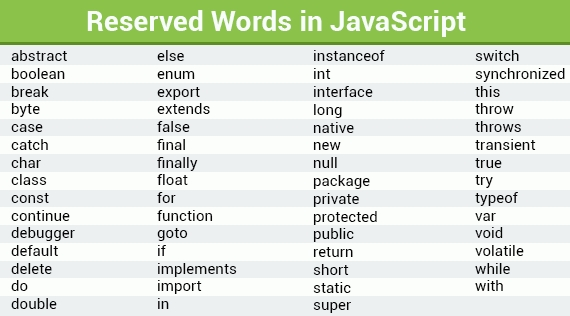

# 1) 변수
## 1. 변수(variable)
1. 정의 : 프로그램이 실행되는 도중에 변경되는 값을 저장하기 위한 이름을 가진 저장소
2. 변수 선언 :  변수 이름을 지정함과 동시에 생성하는 것
    ``` 
    let color;
    ```
3. 변수 저장 : 변수의 이름을 작성하고, 변수의 이름 뒤에 = 연산자를 사용해 원하는 값을 저장
    - 변수의 값을 저장, 대입, 혹은 할당한다고 한다
    ```
    let color = "skyblue";
    console.log(color)l  // skyblue
    ```
4. 재할당 : 변수에 새로운 값을 할당하는 것
    - 변수는 변화하는 값을 저장하는 저장소이기 때문에 중간에 다른 값을 변경할 수 있다
    ``` 
    let color = "skyblue";
    color = "green";
    console.log(color);   // green
    ```


## 2. 변수의 명명 규칙
1. 변수명에는 $기호와 _기호를 제외한 다른 기호는 사용할 수 없다
2. 변수명의 맨 앞에는 숫자를 사용할 수 없다
3. 변수명에는 예약어를 사용할 수 없다

    ``` 
    let $name;
    let my_name;
    let name^;      // Uncaught SyntaxError: Unexpected token '^'
    let my&name;    // Uncaught SyntaxError: Unexpected token '&'
    ket 1st;        // Uncaught SyntaxError: Invalid or unexpected token
    let user1;
    let let;        // 예약어 사용 불가
    ```
    
    - 자바 스크립트 예약어어
    

## 3. 카멜 표기법(Camel calse) 
1. 네이밍 컨텐션(Naming convention) : 두가지 이상의 영어 단어로 이루어진 변수명을 작성할 때 가독성을 높이고 단어를 한눈에 파악할 수 있게 도와주는 표기법
2. 단어를 차례대로 나열하면서 첫 번째 단어를 제외한 각 단어의 첫 글자를 대문자로 작성하는 방법
    
    ```
    let userInfo;
    let isTrueOrFalse;
    ```

## 4. 상수(constant)
- 변하지 않는 값을 저장하기 위한 이름을 가진 저장소
- 상수를 선언할 때는 let이 아닌 <strong>const</strong>라는 키워드를 사용
- 변경도 못하지만 사용하는 이유는 무엇인가...
    - 어떠한 값이 변경될 수 없다고 확신할 떄 실수로 변수의 값이 변경되는 것을 방지하기 위해 사용
    - 예를 들어 생일, 이름
    - 값을 변경할 수 없다는 속성 때문에 이메일아니 홈페이지 주소와 같이 기억하기 어려운 값을 저장해두는 별칭을 사용하기도 한다!
    - 상수를 별칭으로 사용할 때는 상수의 이름을 <strong>모두 대문자로 작성하는 것이 관례</strong>

        ```
        1. 상수 값 변경하기 (x)

        const color = "skyblue";
        color = "yellow";
        console.log(color);

        // TypeError: "color" is read-only

        2. 상수 활용
        const birthday = "08-12";
        const name = "suhyeon/";

        3. 상수 활용2
        const EMAIL_ADDRESS = "cho5881237@gmail.com";
        const PROFIL_URL = "https://suhyeon.com";
        ```

# 2) 자료형
## 1. 자료형
1. 자료형(type) : 변수에 할당되는 데이터의 종류, 변수의 타입
2. 크게 원시 타입과 비 원시 타입으로 나뉜다
  - 원시 타입 자료형
    - 프로그램이 실행되는 도중에 단 하나의 값만 가지는 타입
    - ex) BigInt, 문자, boolean, null, undefined, symbol형
  - 비원시 타입 자료형  
    - 한 번에 여러 개의 값을 가지는 타입
    - ex) 객체, 함수, 배열

    ``` 
    원시 타입 자료형과 비원시 타입 자료형
    let number = 123;         // 원시 타입 자료형
    number = "four";

    let array = [1, "two", 3];   // 비원시 타입 자료형
    ```  

3. typeof 연산자
- 자바스크립트에서 기본으로 제공하는 연산자
- 특정 변수의 자료형을 결괏값으로 반환하는 연산자

    ``` 
    typeof 연산자
    
    let number = 10;
    console.log(type(number));  // number
    console.log(typeof number); // number

    ```

## 2. 숫자형

1. 숫자형 타입(Number 타입)
- 말 그대로 숫자를 나타내는 자료형으로, 정수, 소수 등의 모든 숫자를 나타냄
- 두 개의 변수에 각각 정수와 소수를 할당하고 typeof 연산자를 사용해 변수의 자료형을 모두 출력하면 모두 number라는 값이 출력
- 숫자형 타입은 기본적인 사칙연산 가능!

    ```
    숫자형 타입

    let num1 = 12;
    let num2 = 12.08;

    console.log(num1);  // number
    console.log(num2);  // number
    
    console.log(num1 + 5);  // 17
    console.log(num1 - 5);  // 7

    ```

2. Infinity(무한대)
- 무한대를 나타내는 값으로, 하나의 값으로 변수에 할당할 수 있는 값
- 어느 숫자든지 0으로 나누는 경우 반환되는 값

    ```
    Infinity

    let num1 = Infinity;
    console.log(typeof num1);    // number

    숫자를 0으로 나눈 값.. Infinity
    let num2 = 10 / 0;
    console.log(num2);  // Infinity
    ```

3. NaN
- <strong>Not a Number라는 뜻으로, '숫자가 아니다'</strong>라는 뜻을 가지고 있다
- 변수에 NaN이라는 값을 할당하고 typeof 연산자를 사용해 NaN의 자료형을 출력해 보면 number가 출력!
- NaN 도 Infinity와 같이 하나의 값으로 특정 변수에 할당할 수 있는 값
    - 예를 들면.. 문자열을 숫자로 나누는 것과 같이 부정확한 연산을 할 경우 반환되는 값!

    ```
    NaN

    let num1 = NaN;
    console.log(typeof num);    // number

    // 문자열을 숫자로 나눈 값(숫자가 아니기 때문에).. Nan
    let num2 = "자바스크립트" / 10;
    console.log(num2);          // Nan;
    ```

## 3. BigInt
- 숫자형으로 표현하지 못하는 범위인 2의 53 -1 보다 크거나 -(2의 53승 -1)보다 작은 정수를 나타내야 할 때 사용하는 자료형
- 숫자 끝에 n을 붙이거나 자바스크립트가 제공하는 BigInt()라는 함수를 사용해 나타낼 수 있습니다
    
    ``` 
    BigInt 형 변수

    let binNumber1 = 900000000000000000000n;
    let bigNumber2 = BigInt("900000000000000000000");

    console.log(typeof bigNumber1);     // bigint
    console.log(typeof bigNumber2);     // bigint
    ```

## 4. 문자형
- 변수에 문자열을 할당하기 위해서는 문자열을 따옴표로 묶어야 한다
- 큰따옴표와 작은따옴표는 같은 기능

    ```
    1. 문자형 변수
    let name = "suhyeon";
    console.log(typeof name);   // string

    2. 역따옴표
    let intro = `제 이름은 ${name}입니다.`;
    console.log(intro);         // 제 이름은 suhyeon입니다.
    ```

- 역따옴표(백틱, ``)
    - 역따옴표로 문자열을 묶으면 문자열 안에 있는 특정 변수에 저장된 값을 넣을 수 있다
    - 역따옴표 안에서 특정 변수에 저장된 값을 넣을 때는 $기호 뒤에 중괄호({})를 작성, 중괄호 안에 특정 변수의 이름을 작성
    - 이러한 방식을 <strong>템플릿 리터럴</strong>이라고 하며, 자바스크립트로 프로그래밍할 때 유용하게 사용할 수 있다

## 5. Boolean형
- 참이나 거짓을 표현하기 위한 자료형으로, 값이 true 또는 false로 이루어져 있다
- 조건문을 사용해 변수의 값에 따라 다른 코드를 실행해야 할 때 자주 사용되는 자료형이다

    ``` 
    조건문과 함께 사용되는 Boolean 형
    
    let isClicked = false;
    if(isClicked) {
        console.log("클릭0");
    } else {
        console.log("클릭X");
    }
    ```

## 6. null
- 오직 null 값만 포함하는 자료형으로 사용되고 존재하지 않거나 알 수 없는 값을 나타낼 때 사용됩니다
- Null 오류
    ```
    1. null형

    let name = null;
    console.log(typeof name);   // object

    // name 변수에 null 값이 할당되어 있기 때문에 typeof 연산자를 사용해 자료형을 출력하면 Null이라는 값이 출력돼야 하지만, 출력 결과를 보면 object라는 값이 출력된다 -> 자바스크립트의 오래된 오류로 확인하기 위해서는 밑에와 같이 작성해야 함..
    
    2. 변수가 null 형인지 확인하는 방법
    let name = null;
    console.log(name === null);   // true
    ```

## 7. undefined
- undefined 형은 null 형과 마찬가지로, undefinde 값만을 포함하는 자료형이지만, null 형처럼 값이 존재하지 않거나 알 수 없는 값일 때가 아닌, 변수에 값이 할당되지 않은 상태일 때 자동으로 undefined 값이 할당된다는 차이가 있다

    ```
    undefined 형
    
    let name;
    console.log(name);      // undefined


# 3) 형 변환

## 1. 형 변환

- 자바스크립트가 변수의 자료형을 미리 작성하지 않는 이유?
    - 자바스크립트는 프로그램 실행 중에 자료형이 변환되는 언어이기 때문

    ```
    값이 따라 자료형이 변환되는 자바스크립트

    let num = "100"
    console.log(typeof num);    // string

    num = 10;
    console.log(typeof num);    // number
    ```

- 하나의 변수에 다른 타입의 값을 저장해도 아무런 에러없이 유연하게 값과 함께 타입이 변경되는 언어를 <strong>동적 타입 언어</strong>라고 한다
- 자바스크립트는 자료형이 유연하게 변환되는 동적 타입 언어로, 특정 연산을 위해 자동으로 자료형이 변환되는 경우도 많고 이를 <strong>형 변환</strong>이라고 한다
- js에서 형변환은 데이터를 유연하게 처리하는 데 도움이 되지만, 변수의 자료형을 일관성 있게 유지하기가 어렵고, 잘못 사용할 경우 많은 에러를 발생시킬 수 있기 때문에 주의해서 사용해야 한다!

## 2. 묵시적 형변환
- 자료형이 자동으로 변환되는 형 변환
- 더하기를 제외한 사칙연산을 문자열에 사용하면 문자열을 자동으로 숫자형으로 변환

    ``` 
    값에 따라 자료형이 변환되는 자바스크립트
    
    let num1 = "15";
    let num2 = 5;
    console.log(num1 / num2);   // 3
    ```

## 3. 명시적 형변환
- 자료형이 자동으로 변환되는 것이 아니라 우리가 직접 의도적으로 자료형을 변환시키는 것을 말함
- 사칙연산에서 더하기 연산을 할 경우에 숫자를 문자열로 변환한다 
- 원하는 결괏값을 출력하기 위해서는 자바스크림트가 기본으로 가지고 있는 <strong>parseInt</strong>라는 함수를 사용하면 된다다

    ``` 
    1. 값에 따라 자료형이 변환되는 자바스크립트
    let num1 = "15";
    let num2 = 5;
    console.log(num1 + num2);   // 155

    2. parseInt를 활용한 명시적 형변환
    let num1 = "15";
    let num2 = 5;
    console.log(parseInt(num1) + num2);     // 20
    ```
