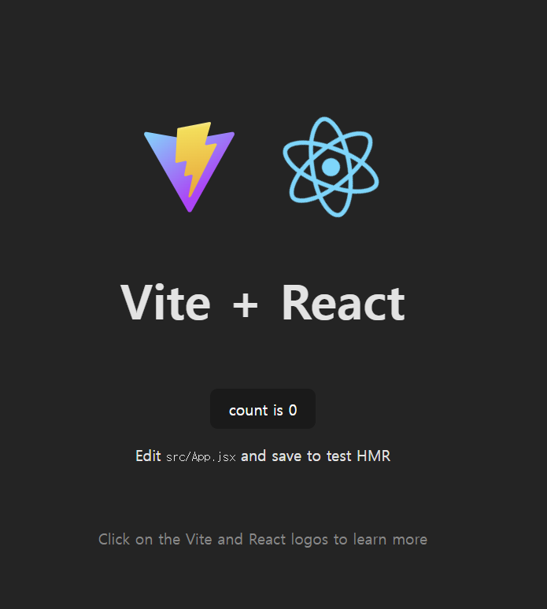

# 1. React.js

## 1. React.js?

- A JavaScript library for building user interfaces

## 2. JavaScript를 사용하면 화면이 부드럽게 전환되는 이유?

- 브라우저에서 JavaScript로 페이지를 업데이트하고 페이지를 다시 로드하지 않고 사용자 인터페이스를 볼 수 있기 때문 

## 3. React 라이브러리가 필요한 이유?

- 응용 프로그램을 만들 때 JavaScript를 사용하면, 코드가 복잡하고 오류가 날 가능성이 많다

1. 컴포넌트 기반 개발 

    - React는 UI를 독립적인 컴포넌트로 분리하여 관리할 수 있도록 지원
    - 이를 통해 재사용 가능한 코드 작성을 유도하고, 코드 복잡도를 낮출 수 있다
    - (e.g.) 예를 들어, 버튼, 입력창, 카드 레이아웃 등을 각각 컴포넌트로 만들면 유지보수가 쉬워지도, 코드 중복이 줄어든다

2. 단방향 데이터 흐름

    - React는 데이터가 부모에서 자식으로만 흐르도록 설계되어 있어, 애플리케이션 상태를 관리하기 쉽다

3. Virtual DOM의 사용
    
    - React는 Virtual DOM(가상 DOM)을 사용해 UI 업데이트를 최적화한다
    - 변경된 부분만 효율적으로 업데이트하기 때문에 실제 DOM 조작보다 성능이 뛰어나고, 대규모 애플리케이션에서도 빠른 속도를 유지할 수 있다

4. JSX의 활용
    
    - React는 JavaScript와 HTML을 결합한 형태인 JSX를 사용하여, UI 코드를 더 직관적이고 읽기 쉽게 작성할 수 있다

5. 유연성과 확장성

    - React는 단순히 UI를 생성하는 데 사용되지만, 필요에 따라 라우팅, 상태 관리 등을 결합해 전체 애플리케이션을 구성할 수 있다

## 4. JavaScript와 React의 차이

- React의 선언형 방식은 UI 상태를 간단히 정의하고, 구현 세부 사항을 React가 알아서 처리한다

    ``` javaScript
    let content;
    if (user.isLoggedIn) {
        content = <button>Continue</button>
    } else {
        content = <button>Log In</button>
    }
    return content;
    ```

- JavaScript의 명령형 방식은 UI를 업데이트하는 과정을 직접 단계별로 작성해야 한다

    ``` javaScript
    let btn = document.querySelector('button');
    if (user.isLoggedIn) {
        button.textContent = 'Continue';
    } else {
        button.textContent = 'Log In';
    }
    document.body.append(btn);
    ```

## 5. React 실행하기

- 브라우저에서 실행하기 : react.new (CodeSandbox : https://codesandbox.io/p/sandbox/react-new?file=%2Fsrc%2FApp.js%3A11%2C1&utm_source=dotnew)

- 내 PC에서 실행하기 : Visual Studio Code (+ Node.js 설치)

    ``` bash
    npm create vite@latest react-project
    ```

    