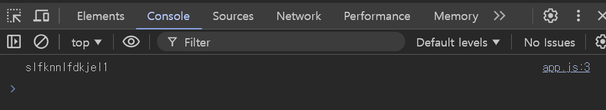

# 1. JavaScript Refresh

## 1. HTML script 속성 추가

- defer

    ``` html
    <script src="assets/scripts/app.js" defer></script>
    ```

    1. HTML 파싱과 app.js 다운로드가 동시에 이루어지고, HTML 파싱이 완료된 후 app.js가 실행된다
    2. DOM이 완전히 로드된 뒤 실행되므로 안정

- type="module"

    ``` html
    <script src="assets/scripts/app.js" type=
     "module"></script>
    ```

    1. 모듈 내에서 선언된 변수나 함수는 해당 파일 내부에서만 유효하며, 다른 스크립트와 충돌하지 않는다
    2. 모듈 간에 import와 export 키워드를 사용해 코드를 공유할 수 있다

        ``` javaScript
        // utils.js
        export const great = () => console.log("Hello!");

        // app.js
        import { great } from './utils.js';
        great();    // "Hello!"
        ```

    3. type="module" 스크립트는 자동으로 비동기적으로 로드되며, HTML 파싱을 중단하지 않습니다

## 2. export & import

1. export (내보내기)

    - 다른 파일에서 사용할 수 있도록 변수, 함수, 클래스 등을 내보내는 역할

        ``` javascript
        // 변수 내보내기
        export let apiKey = 'slfknnlfdkjel1';

        // default 키워드 : 이름 없이 내보내고 원하는 이름으로 불러올 수 있다(파일당 1개)
        export default = 'slfknnlfdkjel1';
        ```

2. import (불러오기)

    - 다른 파일에서 내보낸 항목을 불러오는 역할

        ``` javascript
        // 변수 불러오기
        import { apiKey } from "./util.js";

        console.log(apiKey);

        // default 키워드인 것 불러오기 (중괄호 없이 가져와야 한다!)
        import message from "./util.js";
        console.log(message);
        ```
        
        

3. export와 import의 장점

    - 모듈화 : 코드를 기능별로 나누어 관리할 수 있고 각 파일은 독립적으로 동작하며 다른 파일에서 필요할 때 불러와 사용할 수 있다
    - 재사용성 : 한 번 정의한 코드나 함수는 다른 파일에서 반복해서 사용할 수 있다
    - 네임스페이스 관리 : import를 통해 모듈 내보내기를 잘 관리하면, 네임스페이스 충돌 없이 각 기능을 독립적으로 사용할 수 있다
